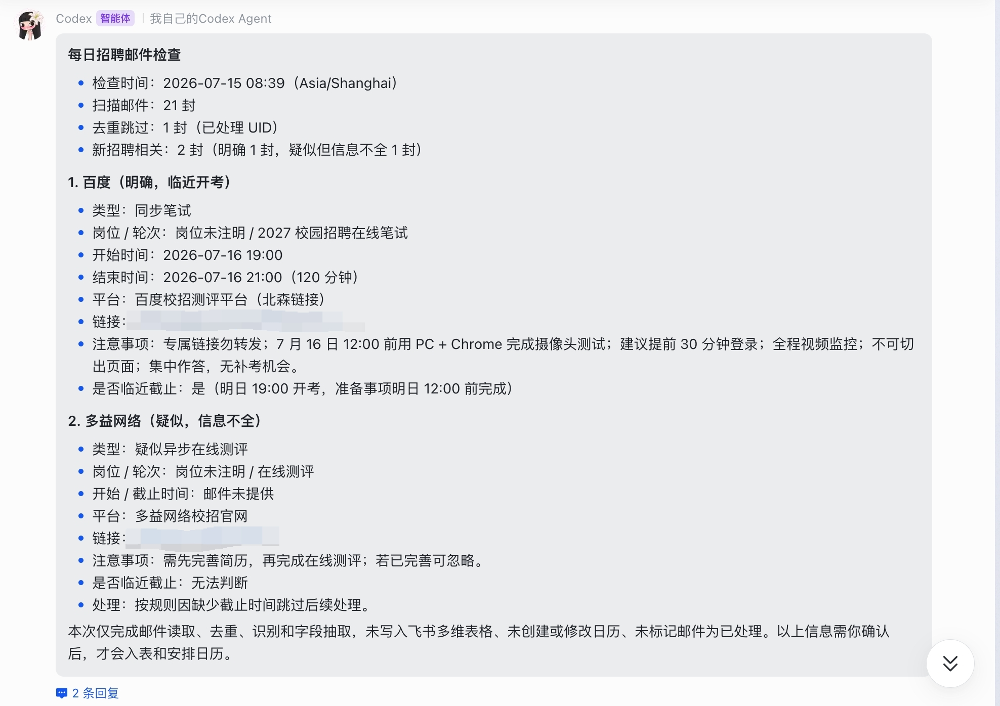
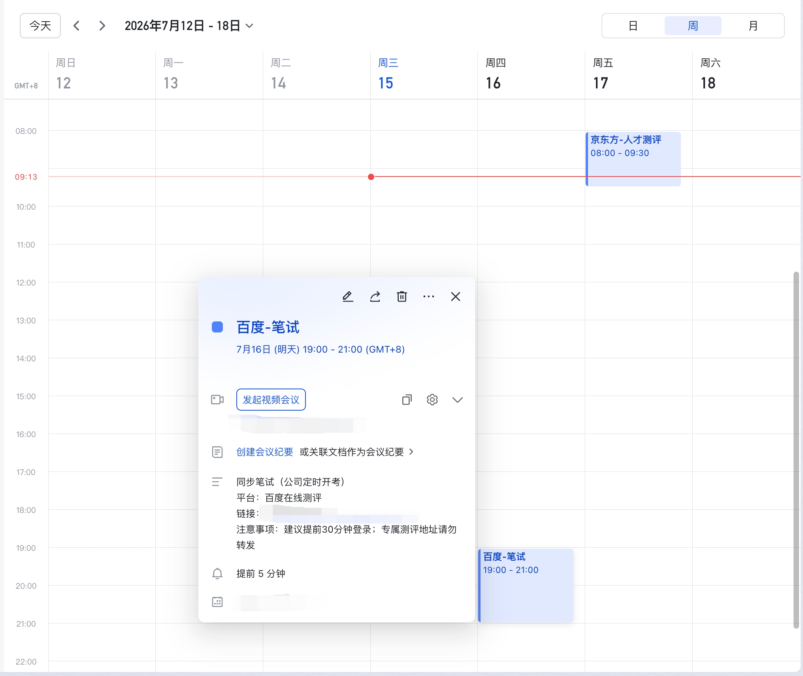
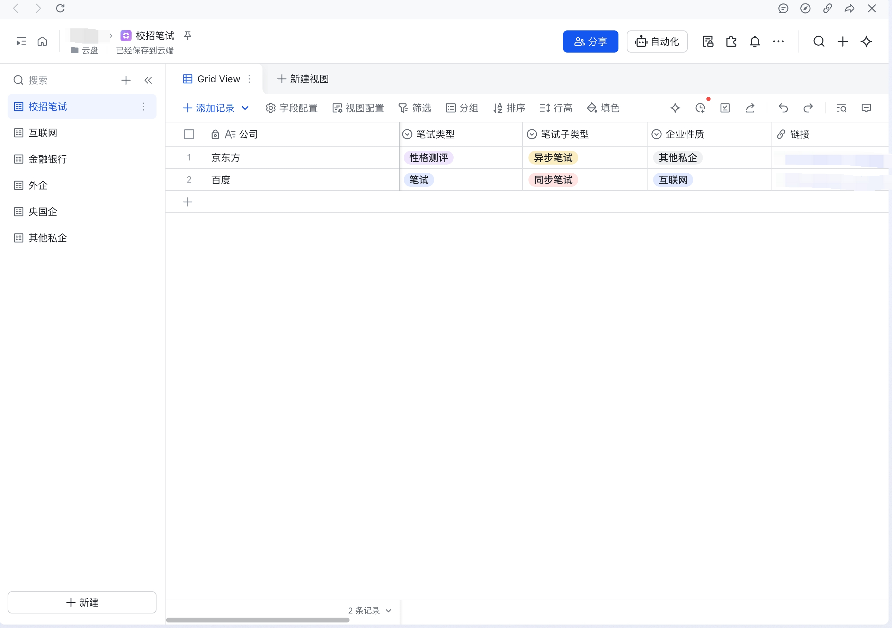

<div align="center">

# OfferLoop

### 从发现机会，到跟进笔试和面试，让秋招进度真正形成闭环。

一个仓库，多个可独立使用的 Agent Skills。

**招聘信息同步 · 投递进度管理 · 邮件识别 · 笔试排期 · 面试提醒**

[](LICENSE)
[](https://www.python.org/)
[](#包含的-skills)

</div>

---

## OfferLoop 解决什么问题

求职信息往往分散在共享招聘表、腾讯文档和邮箱里。发现岗位是一套流程，投递后的笔试、测评和面试又是另一套流程：信息重复、状态断裂、截止时间容易遗漏。

OfferLoop 把这些环节组织成可以逐步启用的工作流：

```text
飞书招聘表 / 腾讯 Smartsheet
              ↓
        job-collection
     筛选、去重、投递进度
              ↓ 可选关联
   recruiting-reminder ← IMAP 邮箱
     笔试、测评、面试、日历
```

每个 Skill 都可以单独使用。安装整个 OfferLoop，不代表必须一次完成所有邮箱和飞书配置。

## 包含的 Skills

| Skill | 作用 | 常见触发方式 |
|---|---|---|
| `offerloop-setup` | 首次环境检查、飞书身份选择、邮箱配置初始化 | “第一次使用 OfferLoop，帮我配置” |
| `job-collection` | 从用户有权访问的飞书 Base 或腾讯 Smartsheet 同步招聘信息 | “把这个招聘表同步到我的求职清单” |
| `recruiting-reminder` | 从 IMAP 邮箱识别笔试、测评和面试，并安排飞书日历 | “检查最近 7 天的笔试面试邮件” |

`job-collection` 不会主动爬取招聘网站，也不会自动投递；`recruiting-reminder` 不会在后台持续监听邮箱。

## 安装

### Skills CLI（推荐）

```bash
npx skills add riwonswain-ovo/OfferLoop -g
```

安装完成后，应能发现三个独立 Skill：`offerloop-setup`、`job-collection` 和 `recruiting-reminder`。

### 手动安装

```bash
git clone https://github.com/riwonswain-ovo/OfferLoop.git
```

将 `skills/` 下的每个 Skill 文件夹复制到 Agent 对应的全局 Skills 目录。例如 Codex：

```text
~/.codex/skills/
├── offerloop-setup/
├── job-collection/
└── recruiting-reminder/
```

不要把仓库根目录整体当成单个 Skill，也不要把三份 `SKILL.md` 合并。

## 新用户：从这里开始

安装后直接告诉 Agent：

```text
请调用 offerloop-setup。我第一次使用，只想先配置招聘信息同步。
```

或者：

```text
请调用 offerloop-setup。我只想先整理邮箱里的笔试和面试。
```

引导流程只配置当前功能需要的部分：

| 想先使用 | 需要 | 暂时不需要 |
|---|---|---|
| `job-collection` | Python、lark-cli bot、目标 Base、招聘信息源 | IMAP、个人日历授权 |
| `recruiting-reminder` | Python、IMAP、lark-cli user、Base 和日历权限 | 招聘信息源、定时同步 |
| 两者联动 | 上述全部，并保存目标求职 Base | 无 |

## 为什么飞书会出现两种身份

OfferLoop 推荐复用同一个 lark-cli profile 和同一个飞书应用，但不同操作使用不同身份：

| 身份 | 用途 | 授权特点 |
|---|---|---|
| `--as bot` | 招聘信息同步、Base workflow、无人值守任务 | 开通应用权限、发布并安装应用，不执行用户登录 |
| `--as user` | 查询个人忙闲、创建个人日历日程 | 应用权限之外，还需用户完成一次授权 |

机器人身份看不到用户自己的主日历，因此日历功能不能静默降级成 bot。用户身份没有完成日历授权，也不会影响纯 `job-collection` 使用。

## 本地配置放在哪里

OfferLoop 不把用户配置写进 Skill 安装目录，避免重新安装或更新时被覆盖。

| 内容 | 默认位置 |
|---|---|
| 公共定位配置 | `~/.config/offerloop/config.json` |
| Job Collection OpenAPI 备用配置 | `~/.config/offerloop/job-collection/.env` |
| IMAP 配置 | `~/.config/offerloop/recruiting-reminder/.env` |
| Reminder Base 定位 | `~/.config/offerloop/recruiting-reminder/base_config.json` |
| 已处理邮件状态 | `~/.local/state/offerloop/recruiting-reminder/processed_emails.json` |

支持 `XDG_CONFIG_HOME`、`XDG_STATE_HOME`。旧版 Skill 目录中的配置仍可读取，但建议通过 `offerloop-setup` 安全迁移。

已有独立版用户请先阅读 [迁移指南](MIGRATION.md)，尤其是 `recruiting-reminder` 用户，应在重新安装前备份邮箱与去重状态。

## 两个业务 Skill 如何联动

联动是可选的，不是硬依赖。

- `job-collection` 在「企业清单」维护公司、招聘批次、招聘岗位和投递进度；
- `recruiting-reminder` 在笔试、面试记录中保存可选的「求职记录ID」；
- 优先用公司、岗位、招聘批次和已投递状态定位申请记录；
- 多个候选时必须让用户选择，不能只按公司名自动关联；
- 找不到对应申请时照常建立笔试或面试记录。

笔试关联成功后，可以把对应求职记录的「是否笔试」更新为「要笔试」。面试关联不会修改该字段。

## 真实使用案例：从招聘邮件到笔试提醒

下面是一次真实的 `recruiting-reminder` 使用过程。Agent 扫描招聘邮箱，先给出识别结果供用户确认，再把确认后的笔试信息写入飞书多维表格并创建日历日程。

| 本次运行 | 结果 |
|---|---|
| 扫描邮件 | 21 封 |
| 去重跳过 | 1 封已处理邮件 |
| 识别结果 | 2 封招聘相关邮件，其中 1 封明确、1 封信息不全 |
| 临近安排 | 识别出 1 场次日开考的同步笔试 |

### 1. 识别邮件并提取关键信息

Agent 从邮件中提取公司、测评类型、开始与结束时间、平台、链接和注意事项，同时区分「明确」与「疑似但信息不全」的邮件。缺少截止时间的信息不会被直接写入，而是保留给用户判断。



### 2. 确认后创建飞书日历日程

用户确认后，明确的笔试被创建为日历日程。日程中保留考试时间、平台、专属链接、注意事项和提前提醒，避免笔试邮件被后续邮件淹没。



### 3. 同步到飞书多维表格

同一条招聘信息也会结构化写入多维表格，保留公司、笔试类型、笔试子类型、企业性质和链接，方便后续筛选、分类和跟进。



> 截图来自真实使用过程，私人账号信息和专属链接均已隐藏。OfferLoop 默认在 Base 写入和日历创建前请求人工确认。

## 使用示例

### 同步招聘信息

```text
请调用 job-collection。
这是我有权访问的招聘信息源：<飞书 Base 或腾讯 Smartsheet URL>。
按我的偏好同步到个人求职清单。
```

### 整理笔试和面试

```text
请调用 recruiting-reminder。
扫描最近 7 天的邮箱，先让我确认识别结果，再同步到飞书并安排日历。
```

### 联动已有求职清单

```text
请调用 offerloop-setup，把这个 Base 设为 OfferLoop 的目标求职清单：<Base URL>。
以后识别笔试和面试时，尝试关联到里面的已投递记录。
```

## 隐私与安全

- 不要在聊天中发送邮箱授权码、App Secret、Cookie、token 或密码；
- IMAP 凭证仅从本机环境变量或私有 `.env` 文件读取；
- 邮件正文会进入当前 AI Agent 上下文用于识别和提取；
- 只读取用户明确提供且有权访问的招聘信息源；
- 任何 Base 写入和日历创建前都保留人工确认；
- 本地配置和状态文件不应提交到 Git。

## 项目结构

```text
OfferLoop/
├── skills/
│   ├── offerloop-setup/
│   ├── job-collection/
│   └── recruiting-reminder/
├── tests/
├── README.md
├── SECURITY.md
├── CONTRIBUTING.md
└── LICENSE
```

未来新增能力继续以 `skills/<skill-name>/SKILL.md` 的形式加入，保持独立触发和独立测试。

## 当前边界

- 需要支持 Agent Skills / `SKILL.md` 的 AI Agent；
- Python 统一要求 3.10 或更高版本；
- 飞书功能依赖可用的 `lark-cli` 和相应权限；
- 腾讯 Smartsheet 读取可能需要用户已登录的本机浏览器；
- 邮件扫描是主动触发的一次性任务，不是邮件服务器守护进程；
- 当前仍分别维护求职清单、笔试和面试数据，跨 Skill 关联为可选能力。

## 开发与测试

```bash
python3 -m unittest discover -s tests -v
python3 -m unittest discover -s skills/job-collection/tests -v
python3 skills/job-collection/scripts/validate_skill.py
```

每个 Skill 都必须拥有正确的 YAML frontmatter，目录名与 `name` 一致，不得包含真实凭证或用户数据。

## License

本项目采用 [MIT License](LICENSE)。
