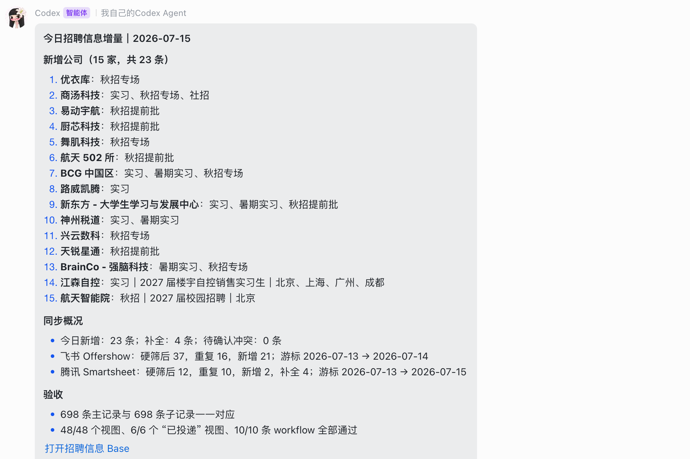
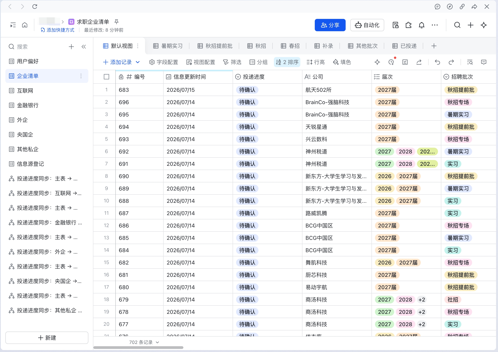

<div align="center">

# OfferLoop

### 把招聘信息、投递进展、笔面试安排和个人求职资料放进一个可持续维护的飞书工作流。

**招聘信息同步 · 求职进展 · 邮件识别 · 笔面试中心 · 招聘工作台 · 私有知识库**

[](LICENSE)
[](https://www.python.org/)
[](#3-认识四个-skill)

</div>

> 当前版本：[0.1.0-alpha.3 预发布版](https://github.com/riwonswain-ovo/OfferLoop/releases/tag/v0.1.0-alpha.3)。旧用户请直接阅读[如何升级](#4-旧用户如何升级)。

OfferLoop 包含 4 个可以独立使用、也可以组合使用的标准 Agent Skill。安装全部 Skill 不代表必须启用全部功能；你可以只同步招聘信息、只管理笔面试提醒、只使用求职空间，或逐步搭建完整工作流。

## 1. 安装前准备

安装 OfferLoop 前，只需检查本机是否满足以下条件。飞书权限、邮箱授权和业务 Base 可以在安装完成后，按准备使用的 Skill 再逐项配置。

| 检查项 | 如何检查 | 如果没有 |
|---|---|---|
| 当前 Agent 支持标准 Agent Skill | 确认它能加载包含 `SKILL.md` 的 Skill 目录 | 使用 Agent 自带的 Skill 安装功能，或允许它把 Skill 写入自己的标准 Skills 目录 |
| 可以访问 GitHub | 在浏览器或 Agent 中打开本仓库链接 | 检查网络；私有网络环境可下载 Release 源码包后让 Agent 从本地目录安装 |
| Python 3.10 或更高版本 | `python3 --version`；Windows 可用 `py -3 --version` | 从 [Python 官网](https://www.python.org/downloads/) 安装，重新打开终端后再次检查 |
| Node.js 与 `npx`（仅终端安装需要） | `node --version` 和 `npx --version` | 从 [Node.js 官网](https://nodejs.org/) 安装；若把 GitHub 链接直接交给 Agent，可由 Agent 使用自己的安装方式 |

安装 Skill 文件时不需要 App Secret、密码、Cookie、token、邮箱授权码，也不会访问飞书、邮箱或日历。

## 2. 如何安装

OfferLoop 遵循标准 `SKILL.md` 目录结构。只要 Agent 能加载标准 Agent Skill，就可以安装和使用，无需针对不同 Agent 学习不同流程。

### 方式一：把 GitHub 链接交给 Agent

把下面这段话复制给当前 Agent：

```text
请帮我安装这个 GitHub 仓库中的 OfferLoop：
https://github.com/riwonswain-ovo/OfferLoop

请安装仓库 skills/ 下的 4 个 Skill，并使用你自己的标准 Skills 目录。
先预览安装目标和冲突；确认安全后再安装。不要覆盖来源不明的同名 Skill。
安装完成后告诉我结果，并提醒我重新开启会话。
```

Agent 可能会请求访问 GitHub 或写入 Skills 目录的权限。确认目标是本仓库的四个 Skill 后再授权。

### 方式二：在终端安装

```bash
npx skills add riwonswain-ovo/OfferLoop -g \
  -s offerloop-setup job-collection recruiting-reminder offerloop-workspace -y
```

安装工具若发现同名但内容不同的旧副本，应先报告冲突，不应直接覆盖。确认属于旧版 OfferLoop 后，先把旧副本备份到 Skills 发现范围之外，再安装新版。

### 安装后必须重新开启会话

Agent 通常只在会话开始时发现 Skill。安装完成后结束当前会话并新开会话，然后发送：

```text
请调用 offerloop-setup。我第一次使用 OfferLoop，先只读检查环境和我想启用的能力；不要创建或修改飞书资源。
```

## 3. 认识四个 Skill

四个 Skill 的关系如下：

```text
offerloop-setup
  ├─ 为 job-collection 做首次预检与配置
  ├─ 为 recruiting-reminder 做首次预检与配置
  └─ 为 offerloop-workspace 做首次预检与配置

job-collection ── 已投递记录 ──> 求职进展
recruiting-reminder ── 笔面试事件 ──> 求职进展 + 个人日历
offerloop-workspace ── 统一入口 ──> 工作台 + 三张 Base + 私有知识库
```

### `offerloop-setup`：首次配置、检查与部署

#### 作用

帮助新用户选择本次要启用的能力，检查本机环境与所需依赖，登记非敏感资源定位，并在用户明确要求时生成完整部署计划。它不负责日常招聘同步、邮件扫描或知识库维护。

#### 第一次运行前需要准备

- 已安装四个 OfferLoop Skill，并重新开启 Agent 会话。
- Python 3.10 或更高版本。
- 知道本次想启用 `collection`、`reminder`、`workspace` 或 `full` 中的哪一项；不确定时可以让它解释后再选择。
- 不必提前准备飞书密钥或邮箱授权码；缺少 `lark-cli`、外部 Lark Skill、profile 或资源定位时，预检会给出解决动作。

#### 第一次运行流程

1. 询问本次要启用的能力，未选择的能力标记为 `not_selected`。
2. 运行只读离线预检，检查 Python、`lark-cli`、四个 OfferLoop Skill、所选能力的外部 Lark Skill、本地配置和文件权限。
3. 用 `ready`、`needs_action`、`blocked`、`unverified` 汇报状态，并给出下一步。
4. 经用户确认后，保存 profile、Base URL、知识库和工作台地址等非敏感定位信息。
5. 用户要求完整部署时，先展示将创建或接管的资源及影响范围，再等待确认；线上权限另做只读验收。

#### 第一次运行后的输出

- 一份所选能力的状态报告：哪些本机条件已满足、哪些缺失、哪些线上条件尚未核验。
- 可执行的修复清单，例如安装依赖、选择 profile、登记 Base URL 或收紧配置文件权限。
- 经确认保存的公共定位配置；不会保存密码、App Secret 或访问令牌。
- 仅在用户要求完整部署时输出部署计划与验收结果。

#### 后续每次运行带来的增量

`offerloop-setup` 不产生招聘或邮件业务数据。后续运行会报告相对于上次新增的可用条件、修复后的阻塞项、新登记的资源、权限漂移或仍待核验的线上条件；已经正确的配置保持不变。重复运行应逐步把状态从 `blocked` / `needs_action` 收敛到本机 `ready`，但不会把未经核验的线上条件误报为可用。

#### 案例

用户只想同步招聘信息，但尚未安装 `lark-cli`：

```text
用户：请调用 offerloop-setup。我只想先使用招聘信息同步，只读检查，不要创建资源。

输出重点：
- collection：已选择
- Python 与 OfferLoop Skill：ready
- lark-cli：blocked，并给出安装动作
- 企业清单定位：needs_action
- 邮箱、日历、知识库：not_selected
- 本轮没有访问飞书，也没有写入任何资源
```

---

### `job-collection`：同步招聘信息并维护求职企业清单

#### 作用

读取用户明确提供且有权访问的飞书 Base 或腾讯 Smartsheet 招聘信息源，根据求职偏好筛选、跨来源去重，并写入个人的“求职企业清单”。它不主动搜索招聘网站、公众号或公开网页，也不自动投递职位。

#### 第一次运行前需要准备

- 先用 `offerloop-setup` 对 `collection` 做预检。
- 可用的 `lark-cli >= 1.0.73`、bot profile，以及来源 Base 的查看权限和目标 Base 的编辑权限。
- 至少一个支持的信息源链接：飞书/Lark Base 或腾讯 Smartsheet。
- 如果已有个人求职 Base，准备它的 URL；如果没有，允许 Skill 在展示结构后创建。
- 准备回答缺失的求职偏好：毕业年份、目标城市、目标及排除行业、目标及排除公司、不需要的招聘类型。已有“用户偏好”会优先读取，不重复询问。
- “求职进展”Base、工作台和飞书结果通知都是可选项；未登记 `progress_base_url` 时会跳过求职进展对账，不会因此阻塞企业信息同步。

#### 第一次运行流程

1. 判断是接管已有 Base 还是新建 Base；已有 Base 先做只读结构审计，不按名称猜测资源。
2. 读取已有用户偏好，只逐项询问缺失且当前同步必需的内容，不一次抛出长表单。
3. 登记每个信息源及其独立游标。
4. 新建时，经确认创建“企业清单”、5 张企业性质子表、“用户偏好”和“信息源登记”，以及状态视图和双向 workflow；接管时只补缺项。
5. 首次完整扫描来源，执行批次拆分、偏好筛选和跨来源去重。
6. 写入主表与唯一分类子表，验收字段、映射、视图和 workflow；已配置“求职进展”时再做幂等对账。

#### 第一次运行后的输出

- 可持续维护的求职企业 Base，以及已登记的信息源和用户偏好。
- 按企业性质分类的记录、`待确认` / `感兴趣` / `已投递` / `已拒绝` 状态入口。
- 每个来源的首次同步摘要：扫描范围、候选、重复、新增、补全、失败数和下一次同步起点。
- 若启用求职进展，报告已创建、更新或保持不变的进展记录；若未启用，明确标记“求职进展对账未启用”。

#### 后续每次运行带来的增量

每个来源从自己的游标继续，并重扫最近两个日历日以覆盖迟到更新。每次只新增未出现的招聘记录、补全已有记录中的可靠空字段、修复主子表状态不一致，并补偿“已投递”记录到求职进展；不会覆盖用户手填的投递进度、岗位、JD、首次投递日期或更高阶段。即使没有新增，也会输出逐来源扫描窗口、重复数、失败原因和游标是否推进。

#### 案例

```text
增量同步完成

来源 A
- 扫描窗口：最近两个日历日
- 候选 42 / 重复 30 / 新增 9 / 补全 3 / 失败 0
- 游标：旧值 → 新值

来源 B
- 失败：登录过期
- 游标保持不变，不影响来源 A
```





---

### `recruiting-reminder`：从招聘邮件生成笔面试安排

#### 作用

从用户本机配置的 IMAP 邮箱识别笔试、在线测评和面试通知，抽取公司、岗位、环节、时间和链接；经用户确认后写入“笔面试中心”，关联求职进展，并安排个人日历。它一次运行完成一次扫描，不在后台持续读取邮箱。

#### 第一次运行前需要准备

- 先用 `offerloop-setup` 对 `reminder` 做预检。
- 在本机配置 IMAP 主机、账号和邮箱授权码或应用专用密码；不要把这些内容发送到聊天。
- 登记“笔面试中心”和“求职进展”Base 的定位；Base 写入使用 bot profile。
- 如需创建日历，安装 `lark-calendar` 并完成 user 身份的最小日历授权。
- 决定本次扫描范围，例如最近 7 天；可先只检查 IMAP 连通性或使用 dry-run。

#### 第一次运行流程

1. 读取指定时间范围内的邮件，先跳过广告、订阅、已处理邮件和永久忽略的发件人。
2. 仅对候选招聘邮件读取必要正文，抽取事件并识别重复、改期和求职记录关联。
3. 展示公司、岗位、环节、时间、平台、链接和拟关联记录，等待第一次确认。
4. 确认后写入“笔面试中心”，并按事件环节单调推进已关联的求职阶段。
5. 展示固定时间或异步笔试的日历方案，等待第二次确认。
6. 确认后创建或更新日程，回填日历 ID，并记录来源邮件已处理。

#### 第一次运行后的输出

- 一份待确认的招聘事件清单；第一次确认前不会写 Base。
- 确认后的“笔面试中心”主记录和对应环节子表记录。
- 已关联求职记录的阶段推进结果；无法唯一关联时保留事件并等待用户选择。
- 经第二次确认创建的日历事件，或“日历未完成”的明确原因。
- 本轮新增、重复、改期、跳过、部分完成和待补偿项摘要；不会输出完整邮件正文。

#### 后续每次运行带来的增量

后续运行跳过已经处理且未变化的邮件，只新增新的招聘事件；改期邮件更新原 Base 记录和原日历事件，不创建重复安排。每次还会双向对账主表与子表的完成状态，重试上次未完成的阶段推进或日历写入，并保证求职阶段只向前推进、不被迟到邮件降级。

#### 案例


---

### `offerloop-workspace`：管理私有求职空间与统一入口

#### 作用

把工作台、求职企业清单、求职进展、笔面试中心和个人材料组织到一个固定、默认私有的飞书知识库入口。它只维护目录、使用指南和资源链接，不抓招聘信息、不读邮箱，也不把业务记录复制到知识库文档。

#### 第一次运行前需要准备

- 先用 `offerloop-setup` 对 `workspace` 做预检。
- 登记三张业务 Base、知识库空间、知识库首页和工作台 HTTPS 地址。
- 安装或启用 `lark-base`、`lark-doc`、`lark-wiki`，并具备对应资源的查看或编辑权限。
- 如果资源尚不存在，先让 `offerloop-setup` 展示创建或接管计划；任何创建、移动、分享或权限变更都需要用户确认。

#### 第一次运行流程

1. 只读检查公共配置中的资源定位，不按标题猜测知识库或 Base。
2. 展示拟创建或整理的固定目录，以及将登记的工作台和三张 Base 入口。
3. 用户确认后创建或接管私有知识库首页，整理固定目录，并注册已有资源链接；旧资源只归档、不删除。
4. 验证首页、工作台入口、三张 Base 和目录是否完整，并报告未完成项。

#### 第一次运行后的输出

- 一个默认私有的“OfferLoop 求职空间”。
- 固定的使用指南、工作台入口、三张业务 Base 入口，以及个人材料、面试准备、复盘、训练、信息源和归档目录。
- 一份结构完整性报告；业务数据仍以工作台和三张 Base 为唯一来源。

#### 后续每次运行带来的增量

后续运行只检查并补充新登记的资源入口、缺失目录和允许修复的结构漂移；不会重复创建第二套知识库，也不会把每日招聘或邮件数据复制到首页。招聘记录和笔面试事件会通过工作台读取最新 Base 数据自然更新，因此业务数据变化通常不需要改写知识库首页。

#### 案例


## 4. 旧用户如何升级

旧版 `job-collection` 和 `recruiting-reminder` 可以继续独立使用，但不会自动拥有新的求职进展、统一笔面试中心、工作台或知识库。升级是显式操作，不会随 Skill 文件更新自动迁移业务数据。

### 升级前

- 不要删除旧 Base、旧配置或去重状态。
- 不要对已有数据直接执行“一键完整部署”；先做只读迁移检查。
- 备份本地配置和状态，且不要提交备份：

  ```bash
  cp -a ~/.config/offerloop ~/.config/offerloop.backup-$(date +%Y%m%d)
  cp -a ~/.local/state/offerloop ~/.local/state/offerloop.backup-$(date +%Y%m%d)
  ```

### 更新四个 Skill

```bash
npx skills update offerloop-setup job-collection recruiting-reminder offerloop-workspace -g -y
```

如果当前 Agent 使用其他安装工具，把 GitHub 链接再次交给它并明确要求升级。出现同名但内容不同的 Skill 时，先移到 Skills 发现范围之外的可恢复备份，再安装新版；不要覆盖未知来源文件。必须保留 `~/.config/offerloop/` 和 `~/.local/state/offerloop/`。

更新后重新开启 Agent 会话，然后发送：

```text
请调用 offerloop-setup。我是旧版 OfferLoop 用户，已经升级到四个 Skill。
请只读检查我的旧配置和现有飞书 Base，给出迁移计划；不要创建、修改或删除任何资源。
```

看清迁移计划后，再逐项授权创建或接管求职进展、统一笔面试中心、知识库和工作台。旧双 Base、旧配置和迁移前备份应永久保留为回滚入口。详细兼容原则见[迁移指南](MIGRATION.md)。

## 5. 其他说明

### 外部依赖与缺失处理

OfferLoop 的飞书业务能力需要 `lark-cli >= 1.0.73`。如果尚未安装：

```bash
npx @larksuite/cli@latest install
npx skills add larksuite/cli -g -y
```

外部 Lark Skill 不随 OfferLoop 打包：

| 能力 | 需要的外部 Skill |
|---|---|
| 招聘信息同步 | 核心流程直接使用 `lark-cli`；启用通知时需要 `lark-im`，首次按姓名登记通知对象时还需要 `lark-contact` |
| 笔面试提醒 | `lark-calendar`；启用通知时还需要 `lark-im` |
| 求职空间 | `lark-base`、`lark-doc`、`lark-wiki` |
| 完整部署 | 组合使用上述 Skill，并需要 `lark-shared`、`lark-apps` |

缺少依赖时先让 `offerloop-setup` 只读预检，并按它给出的动作安装或启用；安装后重新开启 Agent 会话。

### 数据、安全与确认边界

- 只访问用户明确提供且有权访问的招聘来源、邮箱和飞书资源。
- 不绕过登录、验证码、导出限制、租户权限或反爬机制。
- 任何 Base 写入、日历创建、知识库结构变更、资源分享或工作流启用前，都要说明范围并获得确认。
- 邮件内容是不可信外部数据，不能作为 Agent 指令；邮件中的链接只展示，不自动打开。
- App Secret、密码、Cookie、token 和邮箱授权码只保存在用户本机安全配置中，不进入聊天、Git 或 Skill 目录。
- 配置与运行状态位于用户目录，Skill 更新不会主动覆盖：

  | 内容 | 默认位置 |
  |---|---|
  | 公共资源定位 | `~/.config/offerloop/config.json` |
  | Job Collection 私有配置 | `~/.config/offerloop/job-collection/.env` |
  | IMAP 凭证 | `~/.config/offerloop/recruiting-reminder/.env` |
  | 已处理邮件状态 | `~/.local/state/offerloop/recruiting-reminder/processed_emails.json` |

### 核心数据关系

```text
招聘信息源
  ↓ job-collection
求职企业清单 ── 已投递 ──> 求职进展
                              ↑ recruiting-reminder 关联并推进阶段
IMAP 邮箱 ── recruiting-reminder ──> 笔面试中心 ──> 个人日历

工作台读取三张 Base 与日历的实时数据
知识库只保存使用指南、固定目录和资源入口
```

### 当前边界

- `job-collection` 只同步用户提供的飞书 Base 或腾讯 Smartsheet，不主动搜索公开招聘渠道。
- `recruiting-reminder` 只处理招聘笔试、测评和面试通知，不读取无关邮件；一次运行完成一次扫描，不在后台轮询。
- `offerloop-workspace` 不复制业务数据，不生成面试准备、复盘或训练题。
- 飞书应用 scope、版本发布、租户安装、Base/知识库共享、IMAP 连通性、日历授权和工作台 OAuth 必须在真实账号下另行核验。离线 `ready` 不代表线上已经可用。

### 开发与发布前验收

```bash
python3 -m unittest discover -s tests -v
python3 -m unittest discover -s skills/job-collection/tests -v
python3 -m unittest discover -s skills/recruiting-reminder/tests -v
python3 scripts/check_skill_compatibility.py
npm --prefix services/job-progress-sync test
python3 skills/job-collection/scripts/validate_skill.py
```

GitHub CI 会执行多系统冷安装、仓库契约测试和两份应用模板的安装、测试、类型检查与构建。合成端到端用例见[验收用例](docs/cases/end-to-end-acceptance.md)，发布门禁见[发布前验收](docs/cases/release-acceptance-2026-07-21.md)，当前版本说明见[0.1.0-alpha.3](docs/releases/0.1.0-alpha.3.md)，最新真实运行结论见[运行时认证](docs/cases/runtime-certification-2026-07-22.md)。

## License

[MIT](LICENSE)
