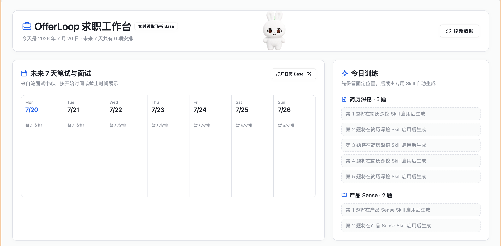
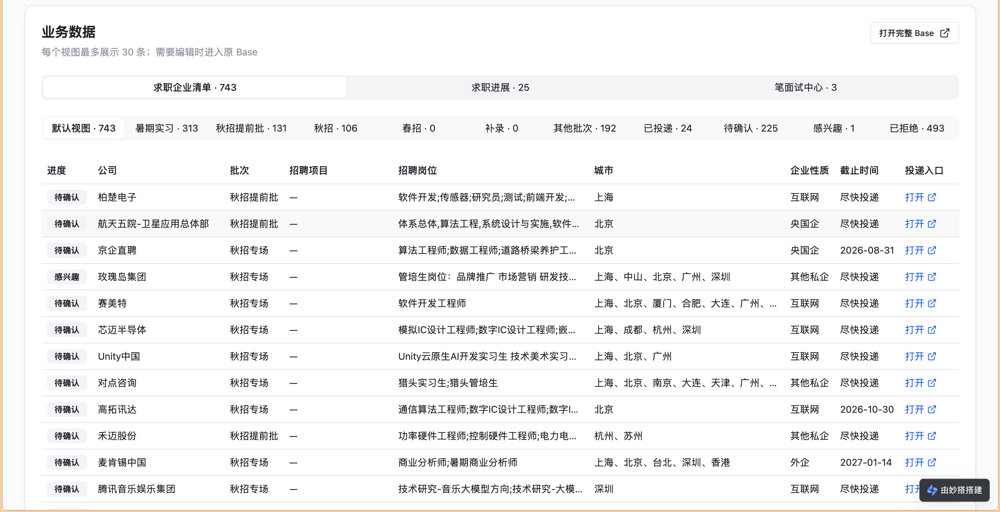
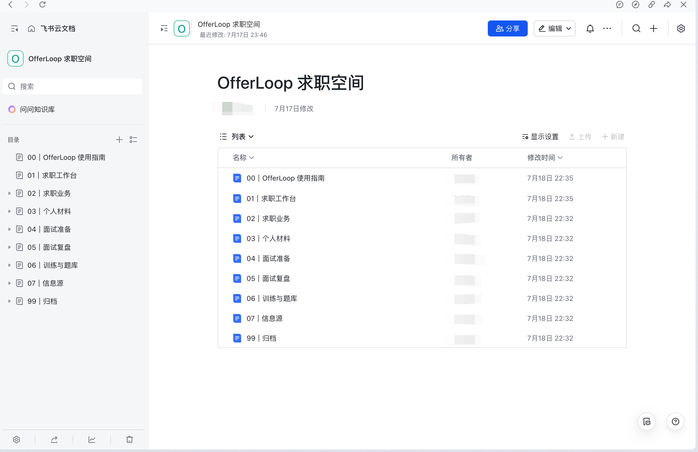
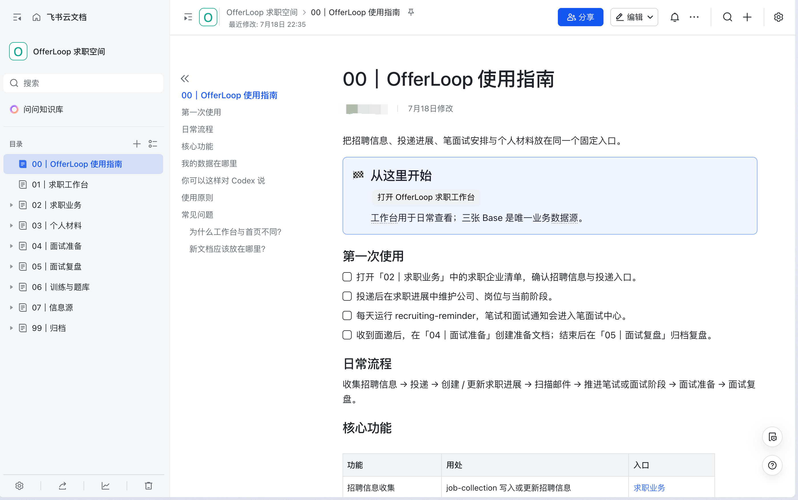

<div align="center">

# OfferLoop

### 把招聘信息、投递进展、笔面试安排和个人求职资料放进一个可持续维护的飞书工作流。

**招聘信息同步 · 求职进展 · 邮件识别 · 笔面试中心 · 招聘工作台 · 私有知识库**

[](LICENSE)
[](https://www.python.org/)
[](#四个-skills)

</div>

> **2026-07 更新**：OfferLoop 从两个独立 Skill 升级为一套四 Skill、三张 Base、一个工作台和一个知识库的求职系统。旧用户请先阅读 [旧用户如何升级](#旧用户如何升级)，不要直接对原有 Base 执行“一键完整部署”。

## 这次更新了什么

- 新增 `offerloop-workspace`：创建并维护私有知识库，把工作台、三张 Base、个人材料和题库入口集中在固定位置。
- 新增独立的「求职进展」Base：当企业清单中的进度变为“已投递”时，可即时创建或更新对应进展；人工填写的岗位、JD 和更后阶段不会被覆盖。
- 新增统一「笔面试中心」Base：主表为“全部安排”，并按笔试、群面、一面、二面、三面、HR 面分表管理；一家公司多个岗位、多轮面试都能独立关联。
- 新增招聘工作台：直接读取飞书 Base，支持未来 7 天笔面试日历、企业清单多视图切换和完整 Base 入口。工作台只展示数据，不复制数据。
- `job-collection` 的企业清单字段精简为招聘事实字段；`recruiting-reminder` 可将识别到的笔面试事件关联并单调推进求职进展。
- 新增可物化的妙搭模板、模板构建 CI、合成端到端验收用例和脱敏发布前验收记录。

## 你最终会得到什么

```text
飞书招聘信息源 / 腾讯 Smartsheet
              ↓
        job-collection
      求职企业清单（事实源）
              ↓ 已投递
          求职进展
              ↑ 关联并单调推进
IMAP 邮箱 → recruiting-reminder → 笔面试中心 → 飞书个人日历
              ↓
      OfferLoop 招聘工作台
              ↓
       OfferLoop 求职空间（知识库）
```

所有 Skill 都可独立使用：不启用邮箱和日历，不影响招聘信息同步；不安装工作台，不影响三张 Base 的正常使用。

## 案例

### 招聘工作台

工作台读取真实飞书 Base：左侧展示未来 7 天笔试与面试，右侧预留每日训练入口；业务区可在企业清单、求职进展和笔面试中心间切换。每个视图最多展示 30 条，需要编辑时直接打开完整 Base。





### 固定的知识库入口

知识库不是数据副本，而是使用指南、工作台、三张 Base、简历、面试准备、面试复盘、题库和信息源的固定目录。业务数据仍以对应 Base 为唯一事实源。





> 截图来自真实使用环境。为展示产品能力，企业名称和招聘数量按用户提供的截图保留；请自行确认公开仓库中的截图符合你的信息披露要求。

## 四个 Skills

| Skill | 职责 | 常见触发方式 |
|---|---|---|
| `offerloop-setup` | 检查环境、登记非敏感资源定位、生成部署计划并协助迁移 | “第一次使用 OfferLoop，先检查环境和我想启用的能力” |
| `job-collection` | 从授权的飞书 Base 或腾讯 Smartsheet 增量同步招聘信息，并补偿对账求职进展 | “同步这个招聘表到求职企业清单” |
| `recruiting-reminder` | 从 IMAP 邮箱识别笔试、测评和面试，先确认再写入笔面试中心/日历 | “扫描最近 7 天招聘邮件，先给我识别结果” |
| `offerloop-workspace` | 管理私有知识库首页、固定导航和资源入口 | “检查我的 OfferLoop 求职空间，只读不要修复” |

## 新用户：从这里开始

### 1. 安装

```bash
npx skills add riwonswain-ovo/OfferLoop -g
```

安装完成后，应能发现四个独立 Skill：`offerloop-setup`、`job-collection`、`recruiting-reminder` 和 `offerloop-workspace`。

如果你手动安装，请将仓库 `skills/` 下的四个目录分别复制到 Agent 的全局 Skills 目录；不要把仓库根目录作为一个 Skill，也不要合并四份 `SKILL.md`。

### 2. 先做只读预检

告诉 Agent：

```text
请调用 offerloop-setup。我第一次使用 OfferLoop，先只读检查环境和我想启用的能力；不要创建或修改飞书资源。
```

预检会区分 `ready`、`needs_action`、`blocked` 和 `unverified`。`unverified` 表示本地配置齐全但尚未连接真实飞书或邮箱验证，不是错误。

### 3. 确认部署计划后再创建资源

```text
请调用 offerloop-setup，一键部署完整 OfferLoop。先展示部署计划；创建 Base、知识库和工作台前向我确认一次，IMAP 只创建本地模板。
```

完整部署会创建三张 Base、私有知识库、工作台模板和即时同步定位信息。飞书扫码、邮箱授权码和任何真实在线验证都需要你亲自完成；不要在聊天中发送密码、token 或 App Secret。

## 旧用户如何升级

本次是结构性升级。旧版的 `job-collection` 和 `recruiting-reminder` 可以继续独立使用，但不会自动拥有新的工作台、知识库、求职进展或统一笔面试中心。

### 升级前须知

- **不要删除旧 Base、旧配置或去重状态。** 新版不会自动删除它们。
- **不要对已有数据直接执行“一键完整部署”。** 先让 `offerloop-setup` 输出只读迁移检查和计划。
- 旧企业清单的字段与新版“求职企业清单”不同；是否新建、迁入或保留旧表，应在迁移计划中逐项确认。
- IMAP 凭证、Base URL 和邮件去重状态仍存于本机私有目录，不应复制进 Skill 目录或 Git 仓库。

### 推荐升级步骤

1. 可选：备份本地配置和状态（不要提交备份）。

   ```bash
   cp -a ~/.config/offerloop ~/.config/offerloop.backup-$(date +%Y%m%d)
   cp -a ~/.local/state/offerloop ~/.local/state/offerloop.backup-$(date +%Y%m%d)
   ```

2. 重新执行安装命令，确保四个 Skill 都更新到同一版本：

   ```bash
   npx skills add riwonswain-ovo/OfferLoop -g
   ```

   手动安装的用户只替换全局 Skills 目录中的四个 Skill 文件夹；**保留** `~/.config/offerloop/` 和 `~/.local/state/offerloop/`。

3. 先运行只读迁移检查：

   ```text
   请调用 offerloop-setup。我是旧版 OfferLoop 用户，已经升级到四个 Skill。
   请只读检查我的旧配置和现有飞书 Base，给出迁移计划；不要创建、修改或删除任何资源。
   ```

4. 看清迁移计划后，再明确授权创建新的三张 Base、知识库和工作台，或逐项迁入旧数据。迁移完成后，运行：

   ```text
   请调用 offerloop-setup，检查完整 OfferLoop 的配置和资源定位；先只读验证，不要修复。
   ```

更详细的兼容原则见 [迁移指南](MIGRATION.md)。

## 核心数据模型

### 求职企业清单

主表及企业性质子表保留 13 个招聘事实字段，依次为：信息更新时间、投递进度、公司、招聘批次、招聘项目、招聘岗位、公告链接、投递链接、投递截止时间、城市、行业标签、企业性质、子表 `record_id`。

投递进度为：`待确认`、`感兴趣`、`已投递`、`已拒绝`。

### 求职进展

独立可编辑 Base，以企业清单 `record_id` 为唯一键。当一条企业信息进入“已投递”时，创建或更新对应进展记录；公司、公告链接和投递链接与企业清单保持一致，投递岗位和岗位 JD 默认留空，由用户填写。重复同步不会覆盖手填岗位、JD、首次投递日期或更后的面试阶段。

### 笔面试中心

一个 Base，主表为“全部安排”，物理子表为笔试、群面、一面、二面、三面和 HR 面。不同岗位和不同轮次都作为独立事件；公司级笔试可以关联多条求职进展。表中预留“面试准备文档”和“面试复盘文档”字段，等待后续专用 Skill 写入。

## 日常使用

```text
请调用 job-collection，把这个我有权限访问的招聘 Base 增量同步到求职企业清单。
```

```text
请调用 recruiting-reminder，扫描最近 7 天招聘邮件。先让我确认识别和关联结果，再写入笔面试中心并安排日历。
```

```text
请调用 offerloop-workspace，检查三个 Base、工作台和知识库首页是否完整；只读检查，先不要修复。
```

## 配置、安全与边界

| 内容 | 默认位置 |
|---|---|
| 公共资源定位 | `~/.config/offerloop/config.json` |
| Job Collection 私有配置 | `~/.config/offerloop/job-collection/.env` |
| IMAP 凭证 | `~/.config/offerloop/recruiting-reminder/.env` |
| 已处理邮件状态 | `~/.local/state/offerloop/recruiting-reminder/processed_emails.json` |

- 公共配置只保存 profile、Base URL、知识库 ID、首页节点、工作台 HTTPS URL 和可选同步定位，不保存密码或 secret。
- Base 写入、日历创建、知识库结构变更前均应保留人工确认。
- 邮件正文只用于当前招聘事件抽取，不写入知识库首页。
- 当前版本仅为“简历深挖”和“产品 Sense”训练保留工作台位置，尚未包含生成训练题的专用 Skill。

## 开发与发布前验收

```bash
python3 -m unittest discover -s tests -v
python3 -m unittest discover -s skills/job-collection/tests -v
python3 -m unittest discover -s skills/recruiting-reminder/tests -v
npm --prefix services/job-progress-sync test
python3 skills/job-collection/scripts/validate_skill.py
```

GitHub CI 还会在 Node 20 下分别安装、测试、类型检查并构建两份妙搭模板。合成端到端用例见 [验收用例](docs/cases/end-to-end-acceptance.md)，本地脱敏发布记录见 [发布前验收记录](docs/cases/release-acceptance-2026-07-20.md)。

## License

[MIT](LICENSE)
