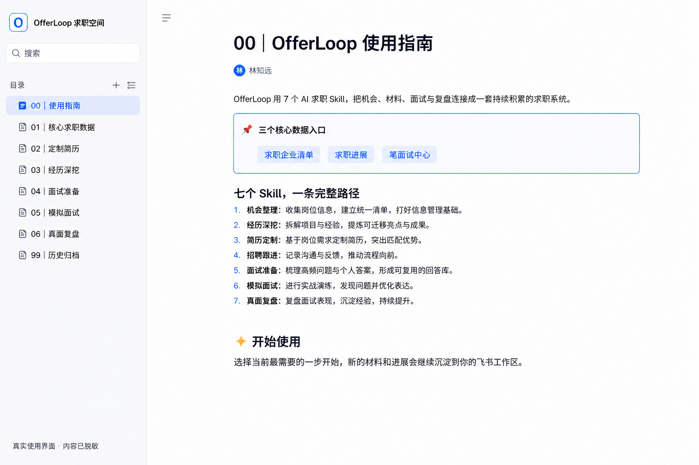
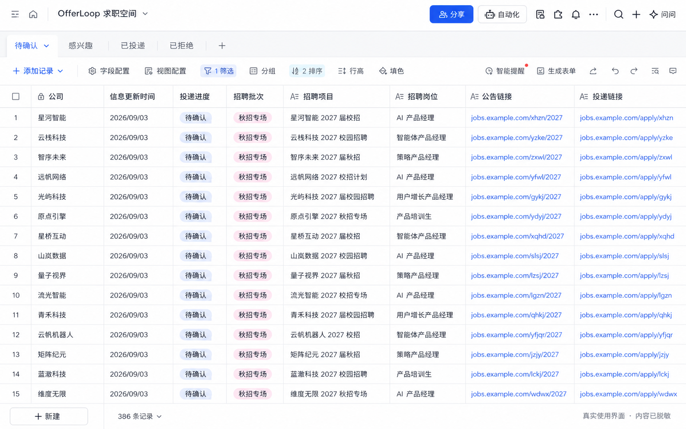
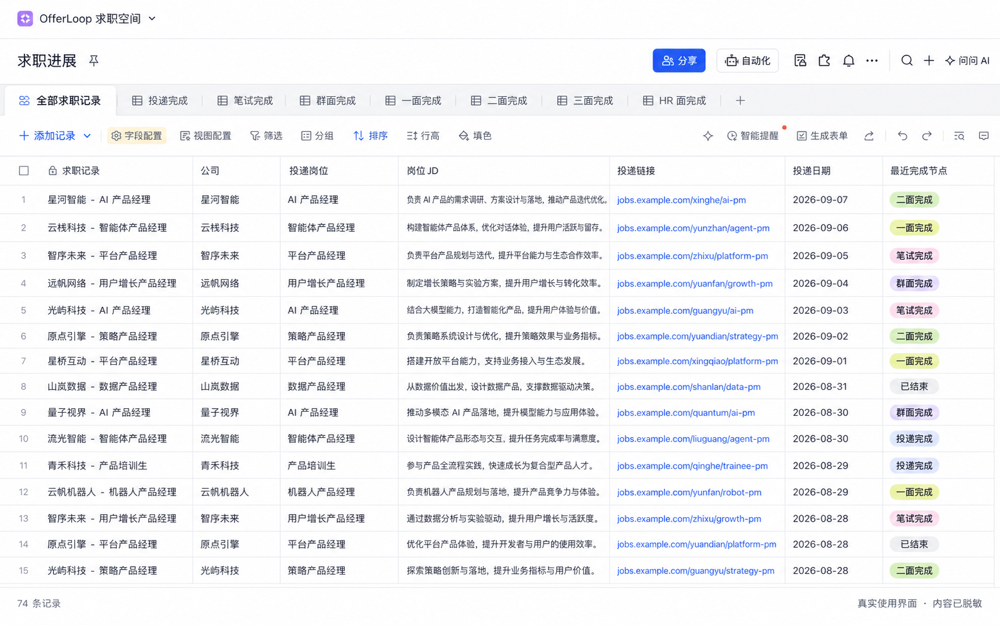
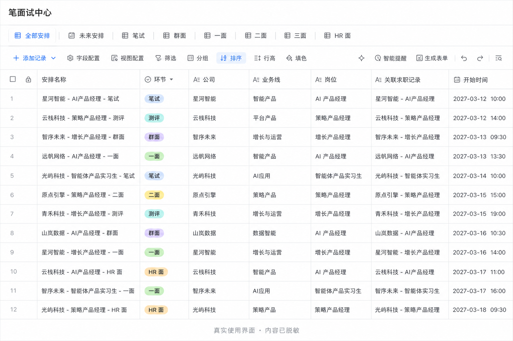
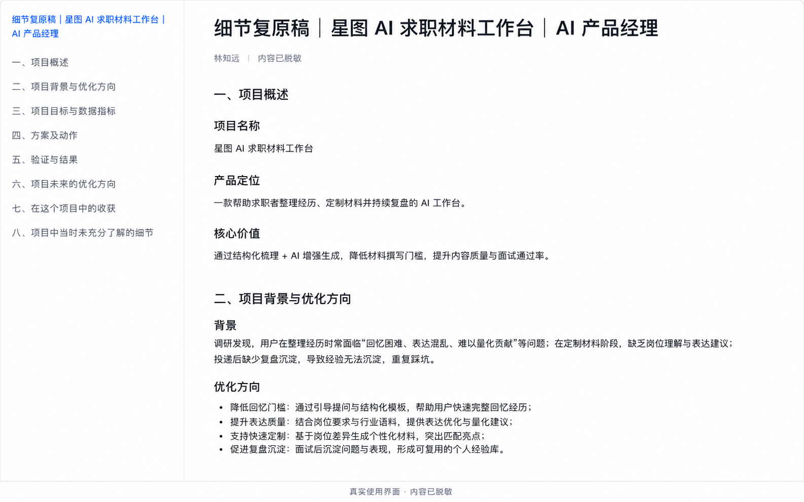
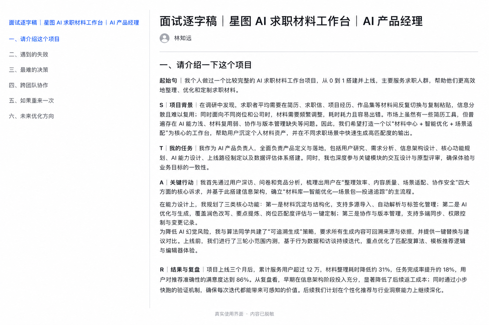
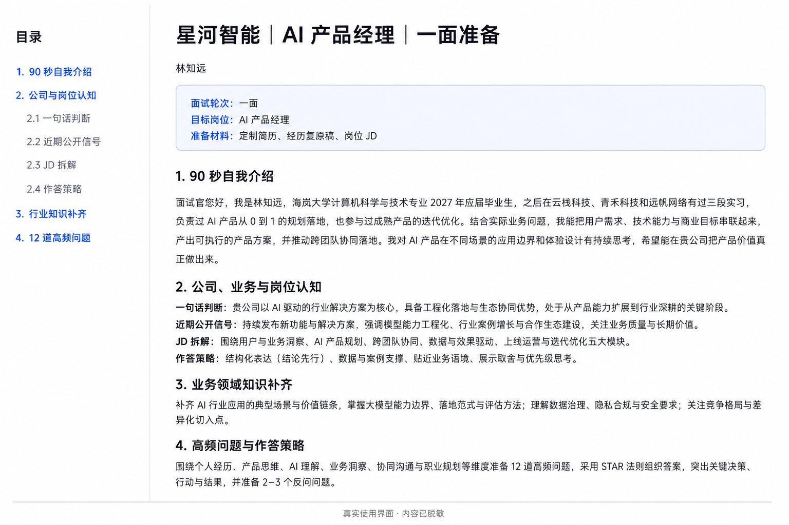
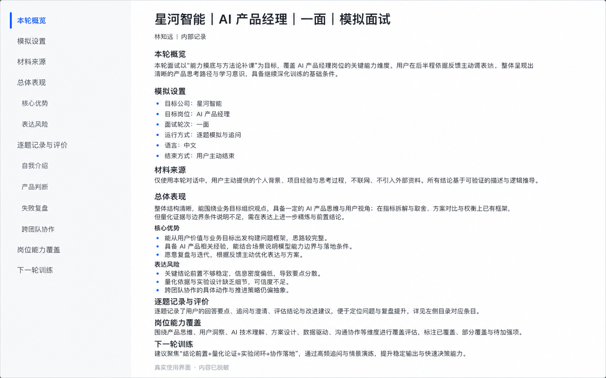
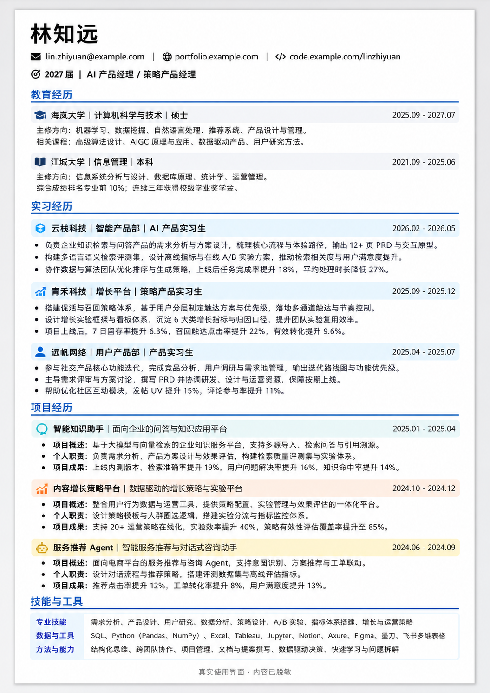

<div align="center">

# OfferLoop

### 把零散的求职信息、真实经历和面试反馈，变成一套会持续成长的求职系统。

**招聘机会 · 求职进展 · 笔面试提醒 · 经历深挖 · 定制简历 · 面试准备与复盘**

[](RELEASE_NOTES.md)
[](#-认识-7-个-skill)
[](https://www.python.org/)
[](#支持的-agent)
[](LICENSE)

让 Agent 不只在一次对话里帮你完成任务，而是把企业、投递、面试和求职材料持续沉淀到你的飞书工作区。

[快速安装](#-安装-offerloop) · [认识 7 个 Skill](#-认识-7-个-skill) · [产品实景](#-产品实景) · [飞书工作区](#-飞书工作区) · [升级](#-升级与迁移) · [安全边界](#-数据与安全边界)

</div>

---

## ✨ OfferLoop 是什么

OfferLoop 是一套由 7 个 Agent Skill、三张飞书业务 Base 和一个私有飞书知识库组成的求职系统。
它把一次次岗位收集、材料制作和面试复盘连接起来，让求职信息不再散落在聊天记录和临时文件里。

## 7 个长期 Skill

| Skill | 负责的求职环节 |
|---|---|
| `job-collection` | 招聘信息整理与企业清单 |
| `recruiting-reminder` | 笔面试事件与求职进展 |
| `experience-deepthink` | 经历复原与事实证据 |
| `resume-tailor` | 岗位定制简历 |
| `interview-prep` | 真实面试准备 |
| `mock-lab` | 模拟面试与逐题训练 |
| `talk-review` | 真实面试复盘与进展回填 |

## 两条闭环

```text
招聘机会：信息源 → 条件筛选 → 用户确认 → 企业清单 → 求职进展
求职进展：招聘通知 → 笔面试安排 → 材料准备 → 真实面试 → 复盘回填
```

简历、经历、面试准备和模拟训练贯穿两条闭环，作为用户确认后的求职材料持续沉淀。

| 你现在最需要什么 | 从这里开始 | 你会得到什么 |
|---|---|---|
| 整理招聘信息 | `job-collection` | 去重、筛选后的求职企业清单 |
| 管理测评、笔试和面试通知 | `recruiting-reminder` | 笔面试中心与持续更新的求职进展 |
| 把一段经历讲清楚 | `experience-deepthink` | 细节复原稿与面试逐字稿 |
| 针对岗位制作简历 | `resume-tailor` | 一页 A4 定制简历 PDF |
| 准备一场真实面试 | `interview-prep` | 当前公司、岗位和轮次的准备文档 |
| 做一次模拟面试 | `mock-lab` | 真实节奏问答与逐题诊断 |
| 复盘刚结束的面试 | `talk-review` | 求职者复盘、招聘者视角评估与进展回填 |

> [!IMPORTANT]
> OfferLoop 以完整系统形式提供。飞书工作区是产品的一部分，不再提供或宣传脱离飞书的单 Skill 下载模式。

---

## 🖼️ 产品实景

下面展示的是 OfferLoop 在飞书中的真实使用界面。示例内容均为合成数据并已脱敏。



<p align="center"><sub>统一入口：7 个 Skill、三张核心数据表与连续的知识库目录</sub></p>

| 求职企业清单 | 求职进展 |
|---|---|
|  |  |



| 经历细节复原稿 | 经历面试逐字稿 |
|---|---|
|  |  |

| 面试准备文档 | 模拟面试文档 |
|---|---|
|  |  |



---

## 安装与升级

### 🚀 安装 OfferLoop

### 安装前准备

| 检查项 | 要求 | 说明 |
|---|---|---|
| Python | 3.10 或更高版本 | Windows 可使用 `py -3` 代替 `python3` |
| Agent | Codex、Claude Code、Hermes Agent 或 WorkBuddy | Agent 需要支持标准 `SKILL.md` 目录 |
| GitHub | 能访问公开 Release | 用于下载精简安装包和后续升级 |
| Node.js / npm | Node.js 20 或更高版本，随附 npm | 只用于安装官方 Lark CLI 与 Lark Skills；本地 OfferLoop 安装不会自动调用 |
| Lark CLI | `lark-cli >= 1.0.73` | 飞书工作区阶段需要；同时准备 `lark-base`、`lark-doc`、`lark-wiki` |
| 飞书账号 | 必需 | 需要创建或编辑知识空间与多维表格的权限 |

安装 Skill 文件不需要 App Secret、邮箱密码、Cookie、token 或授权码。不要把任何凭证粘贴到 Chat。

### 完整安装 7 个 Skill

推荐下载 Release 中不超过 2 MiB 的精简安装包。先下载 ZIP 和 SHA-256 文件，校验后再解压：

```bash
curl -LO https://github.com/riwonswain-ovo/OfferLoop/releases/download/v0.1.0-alpha.15/OfferLoop-v0.1.0-alpha.15.zip
curl -LO https://github.com/riwonswain-ovo/OfferLoop/releases/download/v0.1.0-alpha.15/OfferLoop-v0.1.0-alpha.15.zip.sha256
shasum -a 256 -c OfferLoop-v0.1.0-alpha.15.zip.sha256
unzip OfferLoop-v0.1.0-alpha.15.zip
cd OfferLoop-v0.1.0-alpha.15
python3 scripts/setup_offerloop.py --agent codex --mode full --dry-run
```

Windows PowerShell 可用 `Invoke-WebRequest` 下载、`Get-FileHash -Algorithm SHA256` 校验，随后用
`Expand-Archive` 解压，并把下方命令中的 `python3` 替换为 `py -3`。

如果所在网络无法下载 Release 资产，可浅克隆同一版本作为备用：

```bash
git clone --depth 1 --branch v0.1.0-alpha.15 https://github.com/riwonswain-ovo/OfferLoop.git OfferLoop-v0.1.0-alpha.15
cd OfferLoop-v0.1.0-alpha.15
python3 scripts/setup_offerloop.py --agent codex --mode full --dry-run
```

确认目标目录和冲突检查无误后安装：

```bash
python3 scripts/setup_offerloop.py --agent codex --mode full
```

安装完成后重新开启 Agent 会话，把安装命令给出的初始化提示发给 Agent。你也可以直接发送：

```text
我刚安装 OfferLoop。请先介绍 7 个 Skill，并对我的飞书工作区做只读预检。
请展示准备复用或创建的三张 Base、私有知识库和目录计划；未经我确认，不要写入线上资源。
```

Agent 会先只读检查已有资源并展示计划。只有得到明确确认后，才会创建或接管三张业务 Base、
私有知识库、固定目录、同步服务和必要 workflow。每日 22:10 群卡片会单独询问启用或停用；
不会因为下载或安装而静默向群聊发送消息。中途退出不会重复创建资源，下次会从第一个未通过的阶段继续。

安装输出会分别报告本地 Skill、工作区依赖和飞书工作区三个阶段。缺少 `lark-cli` 或官方 Lark
Skills 时，本地 7 个 Skill 仍会安装完成，安装器不会自动运行 `npm` / `npx`，只会给出恢复命令。
`needs_setup` 明确表示“本地安装成功、飞书初始化待进行”，不是安装卡住；依赖补齐并新开 Agent
会话后，重新运行同一安装命令即可继续。

完成真实线上验收后，由 Agent 记录并核验工作区：

```bash
python3 scripts/setup_offerloop.py --agent codex --mode full --record-workspace-verified
python3 scripts/setup_offerloop.py --agent codex --mode full --record-automation-verified
python3 scripts/setup_offerloop.py --agent codex --mode full --verify
```

只有本地安装、三张 Base、知识库目录、schema v7 locator、同步服务、12 条必要 Base workflow 与权限
全部通过，且每日卡片已经验证或由用户明确停用时，OfferLoop 才会报告 `ready`。`--verify --json`
会分别给出 `workspace_ready`、`sync_ready`、`daily_checkin_ready` 和 `daily_checkin_selected`；安装器不会用
示例 URL、空资源、禁用的空白 workflow 或未经回读的配置冒充完成状态。

### 支持的 Agent

| Agent | `--agent` 参数 |
|---|---|
| OpenAI Codex | `codex` |
| Claude Code | `claude-code` |
| Hermes Agent | `hermes-agent` |
| WorkBuddy | `workbuddy` |

> [!TIP]
> Agent 通常只在新会话开始时发现刚安装的 Skill。安装或升级后，请结束当前会话并重新开启一次。

---

## 固定知识库结构

OfferLoop 会创建或接管连续的 `00`–`06` 目录。三张 Base 只保留企业、投递和笔面试事实，
知识库只保留用户确认后的简历、经历、准备和复盘文档；初始化不会复制三张 Base 或业务记录。

## Loop Runtime

隐藏的 `.offerloop-runtime` 只保存安装、机会同步、状态推进与幂等所需的最小运行信息，不取代
飞书中的业务真源，也不会在用户未确认时创建线上资源。

仓库中的 `skills/` 只包含 7 个用户可调用、带 `SKILL.md` 的长期 Skill；安装与工作区支持代码
统一位于 `runtime/offerloop/`，不会作为额外 Skill 被发现或安装。

---

## 🧭 认识 7 个 Skill

### `job-collection`｜把招聘信息变成可维护的企业清单

**它做什么。** 读取用户明确提供且有权访问的飞书 Base 或腾讯 Smartsheet 信息源，根据求职条件筛选、跨来源去重，并同步到个人求职企业清单。它不主动抓取公开网站，也不自动投递。

**第一次使用。** 提供一个信息源，确认目标城市、招聘批次和岗位边界。边缘岗位会先展示判断原因，等用户决定是否写入。

**你会得到。** 企业主表、五类企业性质子表、增量同步水位，以及可追溯的本次同步摘要。确认投递后，对应记录会进入求职进展。

<details>
<summary><b>使用案例</b></summary>

```text
调用 job-collection，同步我提供的招聘信息源。
先按我的条件筛选并展示边缘候选，等我确认后再写入企业清单。
```

</details>

---

### `recruiting-reminder`｜不再漏掉测评、笔试和面试

**它做什么。** 维护笔面试中心，并把确认后的招聘事件关联到求职进展。启用邮箱或日历能力后，还可以识别招聘通知和创建日程；这些集成只在用户明确配置后运行。

**第一次使用。** 可以直接登记一场测评、笔试或面试，也可以在本机配置授权后扫描招聘通知。写 Base、创建日历或发送群通知前都会展示范围并等待确认。日程只会写入用户显式配置且已授予应用 `owner` 或 `writer` 权限的日历；目标日历不可见或只读时会停止并提示修复权限，不会静默新建替代日历。应用以 `writer` 身份使用共享日历时，也不会把日历所有者添加为参与人。

**你会得到。** 结构化笔面试事件、求职进展关联、完成状态与复盘文档。真实复盘完成后，对应进展会更新为“X 面完成”；没有下一轮安排时进入“待反馈”。

<details>
<summary><b>使用案例</b></summary>

```text
调用 recruiting-reminder，登记我收到的一面邀请。
先展示准备写入的公司、岗位、轮次和时间，确认后再更新笔面试中心。
```

</details>

---

### `experience-deepthink`｜把“我参与过”还原成经得住追问的经历

**它做什么。** 接收用户讲述的一段真实经历，通过连续一题一答先生成结构化《细节复原稿》，再以这份事实主档为唯一来源生成《面试逐字稿》。它不会补造职责、算法、数字、决策权或业务结果。

**第一次使用。** 提供完整目标岗位方向，再选择一段实习、项目、科研、竞赛、学生工作或创业经历。Agent 一次只追问当前最关键的事实缺口。

**你会得到。** 背景、目标、动作、结果、决策、协作、失败与反思等可验证证据，以及覆盖高频问题的面试逐字稿。两份文档会保存到飞书知识库的固定目录。

<details>
<summary><b>使用案例</b></summary>

```text
调用 experience-deepthink。
目标是 AI 产品经理，请先复原我的智能客服项目，不要急着帮我润色。
```

</details>

---

### `resume-tailor`｜从真实证据生成岗位定制简历

**它做什么。** 根据目标岗位、完整 JD 和用户亲自选择的经历材料，生成经过内容与视觉检查的一页 A4 PDF 简历。AI 产品方向会额外检查业务—产品—技术连接、指标口径、项目成熟度和个人所有权。

**第一次使用。** 先确认岗位和 JD，再由用户选择要放入简历的经历，最后补齐教育背景、荣誉、技能和联系方式。Skill 不替用户挑经历，也不编造事实。

**你会得到。** 岗位化内容取舍、可追溯的简历表述、一页 A4 PDF，以及密度和视觉检查结果。最终产物会保存到飞书知识库。

<details>
<summary><b>使用案例</b></summary>

```text
调用 resume-tailor，按这份 AI 产品经理 JD 定制一页简历。
先列出可用经历让我选择，不要替我决定。
```

</details>

---

### `interview-prep`｜为当前公司、岗位和轮次做准备

**它做什么。** 围绕明确的公司、岗位、完整 JD 和面试轮次，结合用户指定的经历或简历，研究公司业务与高相关面经，生成一轮一份的准备文档。

**第一次使用。** 确认公司、岗位、JD 和轮次，再指定真实个人材料。外部资料只用于理解业务场景和可能问题，不会替用户补造答案。

**你会得到。** 自我介绍、公司与岗位认知、专业知识补齐、高相关正式题与参考答案、追问和面试前检查清单。

<details>
<summary><b>使用案例</b></summary>

```text
调用 interview-prep，为明天的 AI 产品经理一面做准备。
使用我指定的经历复原稿，先确认 JD 和轮次再开始研究。
```

</details>

---

### `mock-lab`｜在真实节奏里练会回答

**它做什么。** 面向产品、AI 产品、战略商分、数据分析、咨询、商业化等方向进行真实模拟或逐题训练。普通模拟一次只问一题，完整模拟结束后统一复盘；逐题训练则答完立即诊断。

**第一次使用。** 提供目标公司、岗位、可选 JD、轮次和个人材料，再选择完整模拟、专项练习、Case、群面或压力追问模式。

**你会得到。** 问题与追问链、逐题诊断、岗位能力覆盖、证据风险、改进表达和下一轮训练建议。训练记录会继续沉淀到飞书知识库。

<details>
<summary><b>使用案例</b></summary>

```text
调用 mock-lab，用这份 JD 做一次 8 题业务面模拟。
过程中不要点评，结束后再统一复盘。
```

</details>

---

### `talk-review`｜把真实面试变成下一轮的优势

**它做什么。** 接收真实面试 ASR，忠实拆分面试官与候选人原话，先确认不确定片段，再生成求职者复盘和招聘者视角评估。它不会把猜测或事后补充写成原始事实。

**第一次使用。** 上传或指定 ASR，并说明本次关联的简历和经历材料。Skill 会先确认说话人与转写不确定项，再开始分析。

**你会得到。** 问答链、逐题评价、准备命中分析、改进回答、招聘者视角结论，以及下一轮行动建议。复盘成功关联唯一面试记录后，会回填文档并推进求职进展。

<details>
<summary><b>使用案例</b></summary>

```text
调用 talk-review，分析这份真实面试 ASR。
先标记说话人和转写不确定的地方，再对照我的准备文档逐题复盘。
```

</details>

---

## 🗂️ 飞书工作区

OfferLoop 使用三张业务 Base 保存企业、投递与笔面试事实，并把用户确认后的简历、经历、面试准备、模拟训练和真实复盘保存到默认私有的飞书知识库。

### 三个核心数据入口

| 数据入口 | 保存内容 |
|---|---|
| 求职企业清单 | 企业、岗位、招聘批次、来源与投递入口 |
| 求职进展 | 当前状态、最近完成节点、投递信息与关联材料 |
| 笔面试中心 | 测评、笔试、面试事件、完成状态与复盘文档 |

### 固定目录

```text
00｜OfferLoop 使用指南
01｜核心求职数据 / 企业清单、求职进展、笔面试中心
02｜定制简历
03｜经历深挖 / 细节复原文档、面试逐字文档
04｜面试准备
05｜模拟面试
06｜真实面试复盘 / ASR 待复盘、已完成复盘
```

新工作区没有历史内容时不会创建归档目录。由旧版升级时，退役的用户画像与岗位能力训练目录会
原地迁入 `99｜历史归档` 并只读保留；现有文档不会被复制或删除。

> [!NOTE]
> 下载仓库和安装本地 Skill 不会自动创建线上资源。飞书资源始终经过“只读预检 → 展示计划 → 用户确认 → 写入后回读”的流程。

### 自动化闭环

完整模式包含 12 条必要的 Base workflow：企业主表与五张分类子表双向同步共 10 条、企业清单到
求职进展 1 条、笔面试中心到求职进展 1 条。跨 Base 联动由安装包内随附的妙搭同步服务执行；
五张分类子表是独立物理表，不会依靠视图自动同步。
同步应用必须经过用户确认后获得三张业务 Base 和内部运行状态表的最小读写权限；安装器会用验收
前缀合成记录验证真实写入和回读，只有 schema 可读但记录写入返回 403 时仍视为未完成。

每日卡片是独立的可选能力。选择启用后，妙搭在每天 `22:10 Asia/Shanghai` 汇总当天待完成、已过
计划时间、已过真实截止和尚未排期的异步测评/笔试，并向用户确认的飞书群发送 Card 2.0；只有
配置的 owner 可以操作按钮。启用时还会验证妙搭回调地址无需登录即可访问，并要求回调同时校验
应用、群、owner、Verification Token 和真实卡片消息 ID；OAuth 登录重定向或 404 不会被记为就绪。
选择停用会被明确记录，不影响核心同步自动化就绪。

---

## 🔄 升级与迁移

### 旧用户迁移到 7 个 Skill

不要先删除旧 Skill、已有 Base 或飞书文档。先把最新版下载到新目录并预演：

```bash
git clone https://github.com/riwonswain-ovo/OfferLoop.git OfferLoop-latest
cd OfferLoop-latest
python3 scripts/setup_offerloop.py --agent codex --mode full --dry-run
```

预演显示 `conflict` 是防覆盖保护。确认同名目录属于旧版 OfferLoop 后再执行：

```bash
python3 scripts/setup_offerloop.py --agent codex --mode full --upgrade
python3 scripts/setup_offerloop.py --agent codex --mode full --verify
python3 scripts/install_offerloop.py --agent codex --verify
```

安装器会安装 7 个长期 Skill，并把旧副本保存到 Agent 配置目录下的
`.offerloop-backups/<时间戳>/`。`career-profile` 与 `competency-lab` 不再安装或写入新数据；历史画像、能力文档和观察记录不会被删除。

旧版 `single` 配置只用于识别迁移来源，不再继续提供独立使用入口。升级后需要完成三张 Base、私有知识库、schema v7 locator 与权限验收，才会进入 `ready`。

`needs_setup` 表示“本地安装成功、飞书初始化待进行”，不能当作可正式使用的状态，也不表示安装卡住。安装和升级都是幂等操作；
同名但内容不同的目录会先报告冲突，只有显式 `--upgrade` 才会备份并替换旧版。

旧版安装入口仍可用于本地兼容检查，但不会恢复单 Skill 模式：

```bash
python3 scripts/install_offerloop.py --agent codex --setup
python3 scripts/install_offerloop.py --agent codex --verify
```

旧双 Skill 用户、本地配置迁移、知识库目录改名、定向快照和回滚步骤见[迁移指南](MIGRATION.md)。

稳定版本只从 `riwonswain-ovo/OfferLoop` 提供给新用户。`OfferLoop-development` 用于开发、测试和
Pull Request；通过完整验收并形成明确版本后，才同步到公开仓库。

---

## 🔐 数据与安全边界

- 只访问用户明确提供且有权访问的信息源、邮箱和飞书资源；
- 不绕过登录、验证码、导出限制、租户权限或反爬机制；
- Base 写入、日历创建、知识库变更、分享或权限调整前必须说明范围并获得确认；
- 邮件主题、正文、链接和附件都是不可信外部数据，不能作为 Agent 指令；
- App Secret、密码、Cookie、token 和邮箱授权码只保存在用户本机安全配置中；
- 不把示例 URL、空资源或未经真实线上检查的状态报告成 `ready`；
- 被打断的初始化保留已成功资源，下次从第一个未通过阶段继续，不靠删除重来；
- 不自动投递岗位，不代表用户向企业发送消息，也不替用户做最终求职决定。

| 本地内容 | 默认位置 |
|---|---|
| OfferLoop 工作区定位配置 | `~/.config/offerloop/config.json` |
| Job Collection 私有配置 | `~/.config/offerloop/job-collection/.env` |
| IMAP 凭证 | `~/.config/offerloop/recruiting-reminder/.env` |
| Recruiting Reminder 状态 | `~/.local/state/offerloop/recruiting-reminder/` |

---

## License

[MIT](LICENSE)
