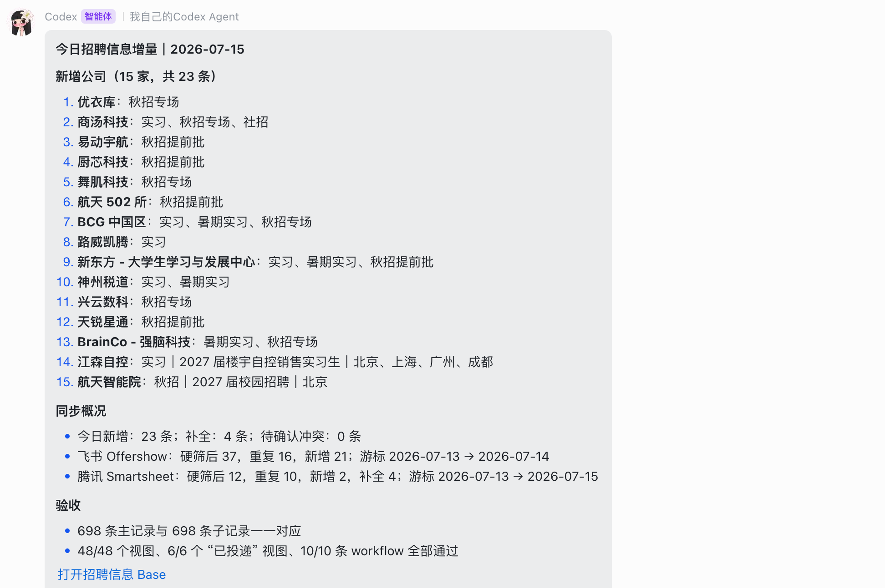
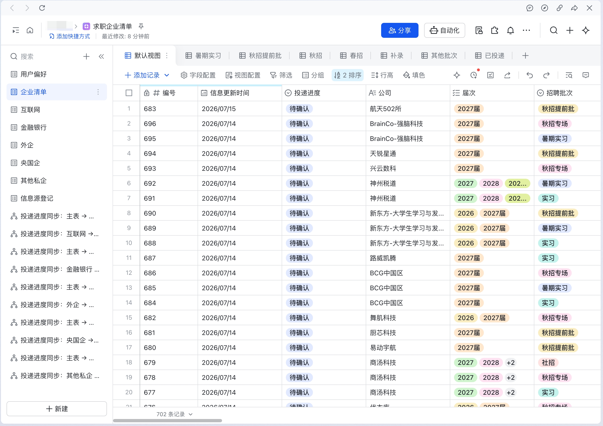
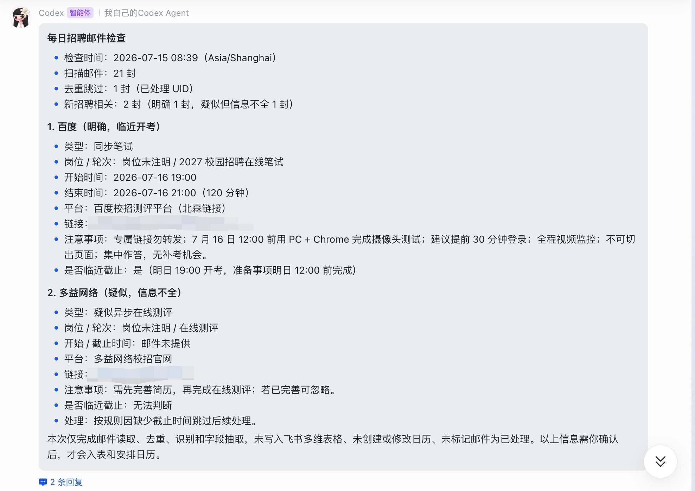
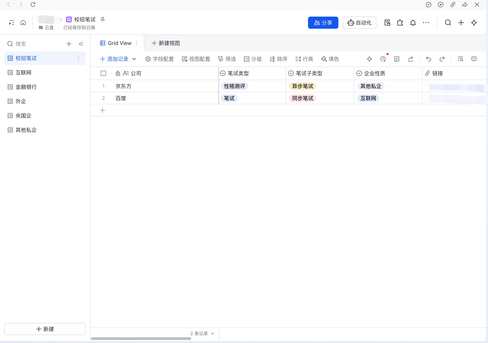
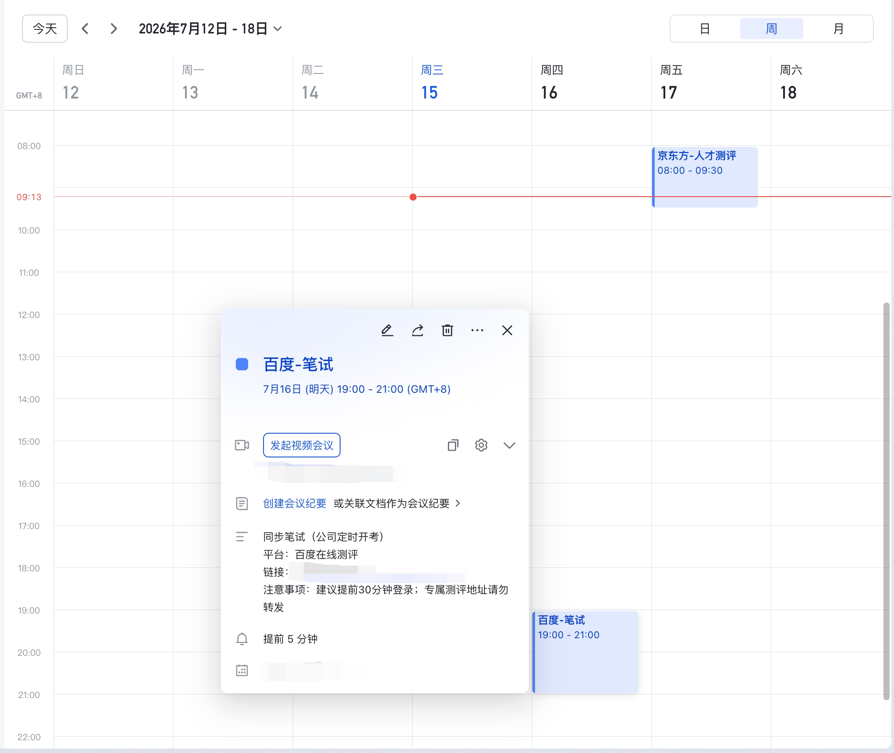
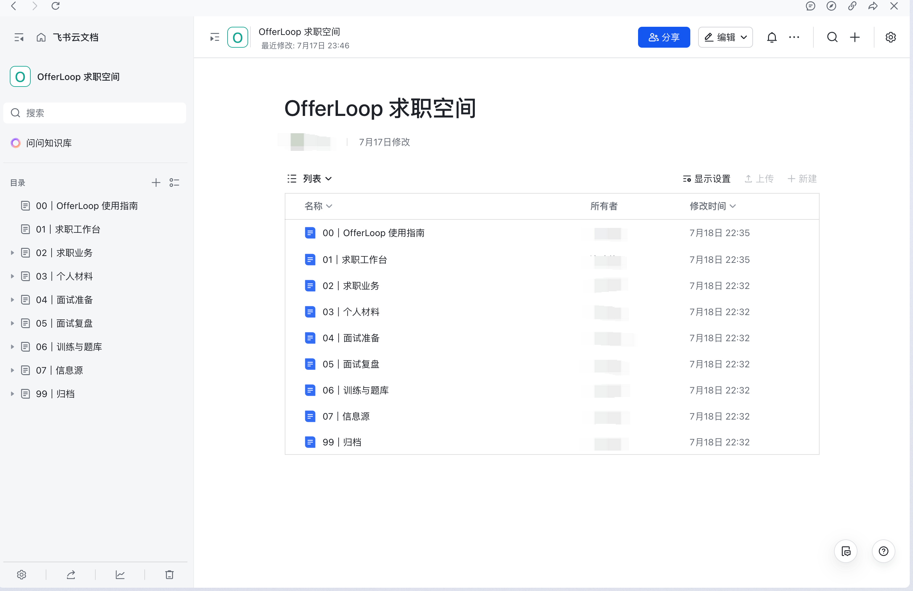
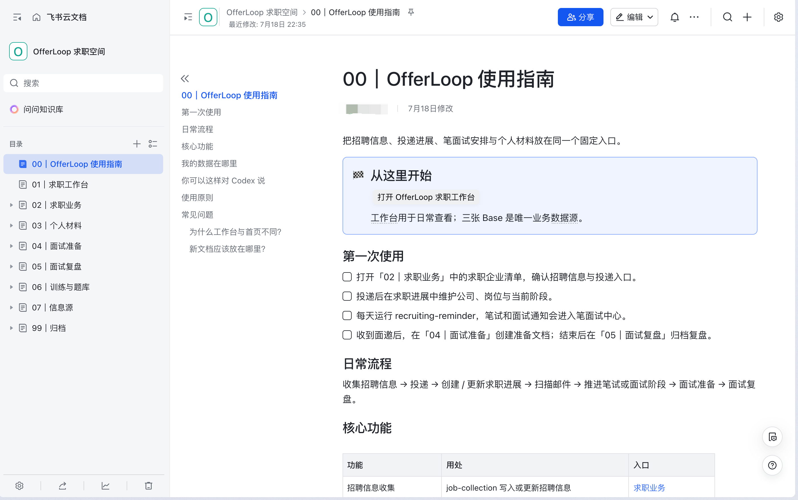
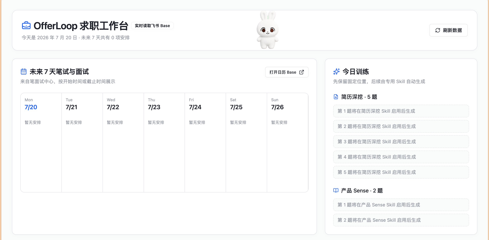
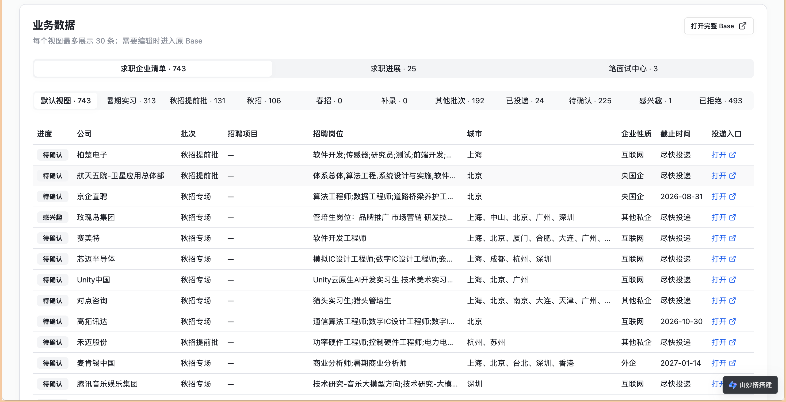

<div align="center">

# OfferLoop

### 把招聘信息、投递进展、笔面试安排和个人求职资料放进一个可持续维护的飞书工作流。

**招聘信息同步 · 求职进展 · 笔面试安排 · 招聘工作台 · 私有知识库 · 求职训练**

[](LICENSE)
[](https://www.python.org/)
[](#3-认识十一个-skill)

</div>

> 当前版本：0.1.0-alpha.8。旧用户请直接阅读[如何升级](#4-旧用户如何升级)。

OfferLoop 包含 11 个标准 Agent Skill。完成线上初始化后一定会有一个默认私有的飞书知识库，
其中组织三张业务 Base、当前简历和每次训练 Markdown 产物；飞书工作台是可选项，未部署不影响
招聘同步、笔面试提醒或任何训练 Skill；`offerloop-agent` 是工作台之上的 Codex 可选加装项。

## 1. 安装前准备

安装 OfferLoop 前，只需检查本机是否满足以下条件。飞书权限、邮箱授权和业务 Base 可以在安装完成后，按准备使用的 Skill 再逐项配置。

| 检查项 | 如何检查 | 如果没有 |
|---|---|---|
| 当前 Agent 支持标准 Agent Skill | 确认它能加载包含 `SKILL.md` 的 Skill 目录 | 使用 Agent 自带的 Skill 安装功能，或允许它把 Skill 写入自己的标准 Skills 目录 |
| 可以访问 GitHub | 在浏览器或 Agent 中打开本仓库链接 | 检查网络；私有网络环境可下载 Release 源码包后让 Agent 从本地目录安装 |
| Python 3.10 或更高版本 | `python3 --version`；Windows 可用 `py -3 --version` | 从 [Python 官网](https://www.python.org/downloads/) 安装，重新打开终端后再次检查 |
| Node.js 与 `npx`（仅终端安装需要） | `node --version` 和 `npx --version` | 从 [Node.js 官网](https://nodejs.org/) 安装；若把 GitHub 链接直接交给 Agent，可由 Agent 使用自己的安装方式 |

安装 Skill 文件时不需要 App Secret、密码、Cookie、token、邮箱授权码，也不会访问飞书、邮箱或日历。

## 2. 如何安装

OfferLoop 遵循标准 `SKILL.md` 目录结构。只要 Agent 能加载标准 Agent Skill，就可以安装和使用，无需针对不同 Agent 学习不同流程。

### 方式一：把 GitHub 链接交给 Agent

把下面这段话复制给当前 Agent：

```text
请帮我安装这个 GitHub 仓库中的 OfferLoop：
https://github.com/riwonswain-ovo/OfferLoop

请安装仓库 skills/ 下的 11 个 Skill，并使用你自己的标准 Skills 目录。
先预览安装目标和冲突；确认安全后再安装。不要覆盖来源不明的同名 Skill。
安装完成后介绍这 11 个 Skill 的用途和一句使用示例，说明隐私边界，并提醒我重新开启会话。
```

Agent 可能会请求访问 GitHub 或写入 Skills 目录的权限。确认目标是本仓库的十一个 Skill 后再授权。

### 方式二：在终端安装

```bash
npx skills add riwonswain-ovo/OfferLoop -g \
  -s offerloop-setup job-collection recruiting-reminder offerloop-workspace \
  offerloop-workbench offerloop-agent experience-deepthink interview-prep mock-lab talk-review pm-sense -y
```

安装工具若发现同名但内容不同的旧副本，应先报告冲突，不应直接覆盖。确认属于旧版 OfferLoop 后，先把旧副本备份到 Skills 发现范围之外，再安装新版。

### 安装后必须重新开启会话

Agent 通常只在会话开始时发现 Skill。安装完成后结束当前会话并新开会话，然后发送：

```text
我刚安装 OfferLoop。请调用 offerloop-setup，先介绍 11 个 Skill，再做只读检查并带我完成第一次使用；不要创建或修改飞书资源。
```

首次安装欢迎会按“4 个核心与业务能力 + 1 个可选工作台 + 1 个可选 Agent + 5 个求职训练能力”介绍十一个 Skill，并给出两条常用
闭环和一条可直接复制的首次使用指令。重复安装不会反复显示完整欢迎；Skill 能被发现仍需重新
开启 Agent 会话。

## 3. 认识十一个 Skill

十一个 Skill 的关系如下：

```text
offerloop-setup
  ├─ 必然初始化 offerloop-workspace 的私有知识库和三张 Base
  ├─ 为 job-collection 做首次预检与配置
  ├─ 为 recruiting-reminder 做首次预检与配置
  └─ 为五个求职训练 Skill 做统一存储预检与配置

job-collection ── 已投递记录 ──> 求职进展
recruiting-reminder ── 笔面试事件 ──> 求职进展 + 个人日历
offerloop-workspace ── 必需核心空间 ──> 私有知识库 + 三张 Base + 训练产物
offerloop-workbench ── 可选体验层 ──> 聚合读取三张 Base + 日历
offerloop-agent ── 可选 Codex 加装 ──> 复用同一工作台右侧栏 + 本机原生 Codex task

experience-deepthink ── 一段真实经历 + 岗位方向 ──> 持续维护的经历深挖文档
pm-sense ── 产品判断与答案 ──> 产品 Sense 训练文档
interview-prep ── 求职进展 JD + 投递简历版本 ──> 面试准备文档
mock-lab ── 当前简历 + 经历深挖 + 可选 JD ──> 模拟面试报告
talk-review ── ASR + 当前简历 + 经历深挖 ──> 真实面试复盘
```

### `offerloop-setup`：首次配置、检查与部署

#### 作用

帮助新用户选择本次要启用的能力，检查本机环境与所需依赖，登记非敏感资源定位，并在用户明确要求时生成完整部署计划。它不负责日常招聘同步、邮件扫描或知识库维护。

#### 第一次运行前需要准备

- 已安装十一个 OfferLoop Skill，并重新开启 Agent 会话。
- Python 3.10 或更高版本。
- 不需要提前记住 Skill 名称。首次运行会先介绍十一个 Skill，再让你从 `collection`、`reminder`、`workspace`、`coaching`、`workbench`、`agent` 或 `full` 中选择；任何选择都检查核心知识库，只有 `workbench` / `agent` / `full` 涉及工作台，`agent` 必须复用已有应用。
- 不必提前准备飞书密钥或邮箱授权码；缺少 `lark-cli`、外部 Lark Skill、profile 或资源定位时，预检会给出解决动作。

#### 第一次运行流程

1. 首次使用时，完整介绍十一个 Skill、使用示例、常用闭环和隐私边界。
2. 询问本次要启用的能力，未选择的能力标记为 `not_selected`。
3. 运行只读离线预检，检查 Python、`lark-cli`、所选 OfferLoop Skill、外部 Lark Skill、本地配置和文件权限。
4. 用 `ready`、`needs_action`、`blocked`、`unverified` 汇报状态，并给出下一步。
5. 经用户确认后，保存 profile、三张 Base、知识库首页与核心数据目录等非敏感定位；工作台验收后才登记其地址。
6. 用户要求完整部署时，先展示将创建或接管的资源及影响范围，再等待确认；线上权限另做只读验收。

#### 第一次运行后的输出

- 一份所选能力的状态报告：哪些本机条件已满足、哪些缺失、哪些线上条件尚未核验。
- 可执行的修复清单，例如安装依赖、选择 profile、登记 Base URL 或收紧配置文件权限。
- 经确认保存的公共定位配置；不会保存密码、App Secret 或访问令牌。
- 仅在用户要求完整部署时输出部署计划与验收结果。

#### 后续每次运行带来的增量

`offerloop-setup` 不产生招聘或邮件业务数据。后续运行会报告相对于上次新增的可用条件、修复后的阻塞项、新登记的资源、权限漂移或仍待核验的线上条件；已经正确的配置保持不变。重复运行应逐步把状态从 `blocked` / `needs_action` 收敛到本机 `ready`，但不会把未经核验的线上条件误报为可用。

#### 案例

用户只想同步招聘信息，但尚未安装 `lark-cli`：

```text
用户：请调用 offerloop-setup。我只想先使用招聘信息同步，只读检查，不要创建资源。

输出重点：
- collection：已选择
- Python 与 OfferLoop Skill：ready
- lark-cli：blocked，并给出安装动作
- 企业清单定位：needs_action
- 邮箱、日历、知识库：not_selected
- 本轮没有访问飞书，也没有写入任何资源
```

---

### `job-collection`：同步招聘信息并维护求职企业清单

#### 作用

读取用户明确提供且有权访问的飞书 Base 或腾讯 Smartsheet 招聘信息源，根据求职偏好筛选、跨来源去重，并写入个人的“求职企业清单”。它不主动搜索招聘网站、公众号或公开网页，也不自动投递职位。

#### 第一次运行前需要准备

- 先用 `offerloop-setup` 对 `collection` 做预检。
- 可用的 `lark-cli >= 1.0.73`、bot profile，以及来源 Base 的查看权限和目标 Base 的编辑权限。
- 至少一个支持的信息源链接：飞书/Lark Base 或腾讯 Smartsheet。
- 先由 `offerloop-setup` 创建或接管核心空间中的企业清单、求职进展和笔面试中心三张 Base。
- 准备回答缺失的求职偏好：毕业年份、目标城市、目标及排除行业、目标及排除公司、不需要的招聘类型。已有“用户偏好”会优先读取，不重复询问。
- 工作台和飞书结果通知是可选项；不部署工作台不会阻塞企业信息同步或求职进展对账。

#### 第一次运行流程

1. 解析核心空间中已登记的企业清单与求职进展 Base，并先做只读结构审计，不按名称猜测资源。
2. 读取已有用户偏好，只逐项询问缺失且当前同步必需的内容，不一次抛出长表单。
3. 登记每个信息源及其独立游标。
4. 初始化企业清单业务结构时，经确认创建 5 张企业性质子表、“用户偏好”和“信息源登记”，以及状态视图和双向 workflow；接管时只补缺项。
5. 首次完整扫描来源，执行批次拆分、偏好筛选和跨来源去重。
6. 写入主表与唯一分类子表，验收字段、映射、视图和 workflow，再对核心空间中的求职进展做幂等对账。

#### 第一次运行后的输出

- 可持续维护的求职企业 Base，以及已登记的信息源和用户偏好。
- 按企业性质分类的记录、`待确认` / `感兴趣` / `已投递` / `已拒绝` 状态入口。
- 每个来源的首次同步摘要：扫描范围、候选、重复、新增、补全、失败数和下一次同步起点。
- 若启用求职进展，报告已创建、更新或保持不变的进展记录；若未启用，明确标记“求职进展对账未启用”。

#### 后续每次运行带来的增量

每个来源从自己的游标继续，并重扫最近两个日历日以覆盖迟到更新。每次只新增未出现的招聘记录、补全已有记录中的可靠空字段、修复主子表状态不一致，并补偿“已投递”记录到求职进展；不会覆盖用户手填的投递进度、岗位、JD、首次投递日期或更高阶段。即使没有新增，也会输出逐来源扫描窗口、重复数、失败原因和游标是否推进。

#### 案例

```text
增量同步完成

来源 A
- 扫描窗口：最近两个日历日
- 候选 42 / 重复 30 / 新增 9 / 补全 3 / 失败 0
- 游标：旧值 → 新值

来源 B
- 失败：登录过期
- 游标保持不变，不影响来源 A
```





---

### `recruiting-reminder`：从招聘邮件生成笔面试安排

#### 作用

从用户本机配置的 IMAP 邮箱识别笔试、在线测评和面试通知，抽取公司、岗位、环节、时间和链接；经用户确认后写入“笔面试中心”，关联求职进展，并安排个人日历。它一次运行完成一次扫描，不在后台持续读取邮箱。

#### 第一次运行前需要准备

- 先用 `offerloop-setup` 对 `reminder` 做预检。
- 在本机配置 IMAP 主机、账号和邮箱授权码或应用专用密码；不要把这些内容发送到聊天。
- 登记“笔面试中心”和“求职进展”Base 的定位；Base 写入使用 bot profile。
- 如需创建日历，安装 `lark-calendar` 并完成 user 身份的最小日历授权。
- 决定本次扫描范围，例如最近 7 天；可先只检查 IMAP 连通性或使用 dry-run。

#### 第一次运行流程

1. 读取指定时间范围内的邮件，先跳过广告、订阅、已处理邮件和永久忽略的发件人。
2. 仅对候选招聘邮件读取必要正文，抽取事件并识别重复、改期和求职记录关联。
3. 展示公司、岗位、环节、时间、平台、链接和拟关联记录，等待第一次确认。
4. 确认后写入“笔面试中心”，并按事件环节单调推进已关联的求职阶段。
5. 展示固定时间或异步笔试的日历方案，等待第二次确认。
6. 确认后创建或更新日程，回填日历 ID，并记录来源邮件已处理。

#### 第一次运行后的输出

- 一份待确认的招聘事件清单；第一次确认前不会写 Base。
- 确认后的“笔面试中心”主记录和对应环节子表记录。
- 已关联求职记录的阶段推进结果；无法唯一关联时保留事件并等待用户选择。
- 经第二次确认创建的日历事件，或“日历未完成”的明确原因。
- 本轮新增、重复、改期、跳过、部分完成和待补偿项摘要；不会输出完整邮件正文。

#### 后续每次运行带来的增量

后续运行跳过已经处理且未变化的邮件，只新增新的招聘事件；改期邮件更新原 Base 记录和原日历事件，不创建重复安排。每次还会双向对账主表与子表的完成状态，重试上次未完成的阶段推进或日历写入，并保证求职阶段只向前推进、不被迟到邮件降级。

#### 案例







---

### `offerloop-workspace`：维护必需的私有求职知识库

#### 作用

创建或接管一个固定、默认私有的飞书知识库，把企业清单、求职进展、笔面试中心三张 Base
作为唯一对象纳入核心数据目录，并保存当前简历和每次训练产生的 Markdown 飞书文档。它不抓
招聘信息、不读邮箱，也不负责搭建工作台。

#### 第一次运行前需要准备

- 先用 `offerloop-setup` 对 `workspace` 做预检。
- 登记三张业务 Base、知识库空间、知识库首页和核心数据目录。
- 安装或启用 `lark-base`、`lark-doc`、`lark-wiki`，并具备对应资源的查看或编辑权限。
- 如果资源尚不存在，先让 `offerloop-setup` 展示创建或接管计划；任何创建、移动、分享或权限变更都需要用户确认。

#### 第一次运行流程

1. 只读检查公共配置中的资源定位，不按标题猜测知识库或 Base。
2. 展示拟创建或整理的固定目录，以及三张 Base 将被纳入的位置。
3. 用户确认后创建或接管知识库，把既有 Base 移入/登记为 Wiki 节点；不复制数据。
4. 验证首页、核心数据目录、三张 Base 和训练目录是否完整。

#### 第一次运行后的输出

- 一个默认私有的“OfferLoop 求职空间”。
- 固定的使用指南、三张业务 Base 节点，以及当前简历、面试准备、ASR、复盘和
  训练目录。
- 一份结构完整性报告；三张业务 Base 始终是唯一业务真源。

#### 后续每次运行带来的增量

后续运行只检查并补充缺失节点、保存训练产物和修复用户允许的结构漂移；不会重复创建第二套
知识库或 Base，也不会把每日业务数据复制到首页。工作台存在与否不改变知识库职责。

#### 案例





---

### `offerloop-workbench`：按需搭建飞书可视化工作台

#### 作用

只有用户明确选择时，创建或接管妙搭应用，铺设工作台模板，配置 OAuth、发布并完成浏览器验收。
工作台只聚合读取三张既有 Base 和日历，不拥有任何核心数据。

#### 第一次运行前需要准备

- OfferLoop 知识库与三张 Base 已完成初始化。
- 用户具备妙搭应用创建、环境配置、发布和飞书应用 OAuth 配置权限。

#### 第一次运行流程

1. 只读核验知识库和三张 Base locator。
2. 创建或接管妙搭应用，先 dry-run 预览模板覆盖范围。
3. 经确认铺设模板，配置 OAuth 与环境变量并发布。
4. 完成首屏、三张 Base、日历授权和刷新后的浏览器验收。

#### 第一次运行后的输出

- 一个可选的招聘数据与日历聚合界面。
- 经验证的 HTTPS 工作台入口。
- 未部署、停用或部署失败时，其他 Skill 和知识库继续正常运行。

#### 后续每次运行带来的增量

后续运行只升级已登记应用、检查 OAuth 和页面性能，不创建第二套 Base，也不改变知识库或业务
数据所有权。

#### 案例





---

### `offerloop-agent`：在已有工作台中加装 Codex

#### 作用

把已经跑通的工作台右侧栏、任务队列和本机 Codex app-server worker 作为可选 add-on
安装进同一个妙搭应用。工作台新建对话时，本机 Codex 会出现一个原生 task；续聊、停止和归档
沿用该 task。

#### 第一次运行前需要准备

- 必须先有 `offerloop-workbench`，不会新建第二个妙搭应用。
- 已知现有工作台 URL、同一妙搭应用的 App ID、本地项目目录和当前飞书用户 ID。
- 本机已安装 Node.js 22+ 与 Codex。

#### 第一次运行流程

1. 对现有工作台运行 dry-run，预览右侧栏、队列模块和 migration。
2. 经确认后铺设 add-on，并为同一 App ID 创建仅含两个 worker 路由的 OpenAPI Key。
3. 把密钥存入本机钥匙串，将 Worker 绑定当前飞书用户 ID，再启动主动轮询。
4. 构建、发布并验收原工作台；不创建新应用。

#### 第一次运行后的输出

- 原工作台中的可开关右侧智能助手。
- 一个只主动出站连接工作台的本机 worker。
- 工作台对话与原生 Codex task 的一一对应。

#### 后续每次运行带来的增量

后续运行幂等升级 Agent 自己拥有的源码和 worker，不覆盖工作台绑定、环境文件、OAuth 配置或
业务数据。provider 适配仍与工作台主体隔离。

#### 案例

```text
调用 offerloop-agent，把 Codex 接入我已经部署好的 OfferLoop 工作台。
先预览变更，不要创建第二个妙搭应用。
```

#### 边界

- 当前只支持 Codex；工作台本身不绑定具体 Agent provider。
- 共享同一工作台时，每个 Worker 只领取其绑定飞书用户创建的任务。
- 不安装或停用时，知识库、三张 Base 和其他 Skill 均不受影响。

---

### `experience-deepthink`：按岗位方向持续深挖一段经历

#### 作用

先确认一段真实经历和目标岗位方向，再通过连续一题一答完成根因、归属、落地、价值和复盘
五层钻取。经历可以是实习、项目、科研、校园竞赛、学生工作、创业、志愿服务或其他实践。
岗位方向是开放输入，产品、技术、运营、财务、HR、法务、市场、销售或复合岗位都可直接使用；
现有岗位 playbook 只是可选参考，不是准入白名单。

#### 第一次运行前需要准备

- 不需要预先读取或上传简历，也不要求先完成飞书配置或准备 JD。
- 只需准备在 Chat 中讲述一段真实经历，并说明想用它准备哪个岗位方向。
- 如需将结果保存到飞书，可在完成首次讲述后再配置对应能力。

#### 第一次运行流程

1. 直接邀请用户在 Chat 中讲述经历，并同时说明目标岗位方向。
2. 从首次讲述中确认经历名称和类型，再逐层追问背景、目标、职责、行动、决策、协作、困难、
   结果和反思。
3. 每阶段复述已确认事实与缺口，用户确认后再更新口述稿和素材。
4. 按“经历名称 + 岗位方向”精确定位并维护同一份 Markdown 飞书文档。
5. 将数字口径、证据边界和仍待补充的线索保留在文档中。

#### 第一次运行后的输出

- 严格按金字塔原理组织的 1 分钟和 3 分钟基础经历口述稿。
- 背景、目标、方案与行动路径、结果各自的 3 分钟金字塔口述稿及详细分要点。
- 嵌入各要点的数据、证据、团队与个人贡献边界，以及失败、冲突、决策、协作和重来改进故事。
- 待补充事实和建议继续深挖的方向。

#### 后续每次运行带来的增量

同一段经历和同一岗位方向无论深挖多少次，都更新同一份文档；新一轮把新增或修正事实直接
合并进对应章节，不保留运行元数据或维护记录。岗位方向不同才建立另一份专属文档。

#### 案例

```text
调用 experience-deepthink。我会直接在 Chat 中讲一段校园竞赛经历，想用它准备财务分析岗。
请从我的讲述开始，一次只问一个问题，并持续维护同一份经历文档。
```

---

### `pm-sense`：产品思维训练

#### 作用

训练产品设计、策略、商业化、AI 产品和发散场景题。用户先独立回答，再通过点评、追问、公开
研究和自主总结形成可复用答案。

#### 第一次运行前需要准备

- 启用 `coaching` 和 `05｜产品 Sense` 目录。
- 准备一道题；没有题目时可让 Skill 给出三个不同题型。
- 如要延续某次训练，可指定对应产品 Sense 训练文档。

#### 第一次运行流程

1. 用户先独立初答，Skill 不提前给框架。
2. 每轮只推进最关键的两至三个判断。
3. 用户自主总结后，再查询官方资料和可靠外部证据。
4. 生成 1 分钟/3 分钟答案并保存 Markdown 飞书文档。

#### 第一次运行后的输出

- 原始答案、逻辑问题、确认判断和研究证据。
- 完整分析链、反方观点、失败风险和验证指标。
- 1 分钟与 3 分钟口语答案、后续追问和迁移方法。

#### 后续每次运行带来的增量

每次训练保存独立文档，并把值得继续准备的问题保留在后续训练计划中。

#### 案例

```text
调用 pm-sense，训练“为大学生设计一款 AI 搜索产品”。
让我先回答，不要先给框架。
```

---

### `interview-prep`：生成岗位化面试准备文档

#### 作用

从求职进展读取岗位 JD 和用户维护的投递简历版本，再精确读取知识库中的同名当前简历，结合
公开公司研究生成针对当前公司、岗位和轮次的面试准备文档。

#### 第一次运行前需要准备

- 一条面试事件或明确的公司、岗位、轮次。
- 求职进展中已维护岗位 JD 和投递简历版本。
- `lark-base`、`lark-doc`、`lark-wiki` 可用。

#### 第一次运行流程

1. 通过精确 record ID 或统一事件查询接口确认面试事件。
2. 读取求职进展中的 JD 和简历版本，再精确读取对应当前简历；按需读取方向和经历匹配的经历深挖文档。
3. 使用公司官网、公告、财报和官方产品资料研究岗位。
4. 生成能力映射、追问、回答提纲、风险和检查清单，保存后回填笔面试中心。

#### 第一次运行后的输出

- 公司、业务、岗位和 JD 能力模型。
- 用户证据映射、简历逐项追问、高频题与回答提纲。
- 产品题准备、压力追问、反问和面试前清单。

#### 后续每次运行带来的增量

每次面试生成独立文档并关联精确事件；同一 `run_id` 重试幂等，主表和明确轮次子表保持一致。

#### 案例

```text
调用 interview-prep，为笔面试中心里明天的 AI 产品经理一面生成准备文档。
使用我当时实际投递的简历。
```

---

### `mock-lab`：真实节奏模拟面试

#### 作用

先确认目标岗位、可选 JD 和面试模式，再按需组合通用协议、岗位 Playbook、问题模式及用户指定
的简历、经历深挖或面试准备材料，进行一题一答动态模拟，结束后统一提供逐题评价。没有对应岗位
Playbook 或飞书材料时也可以直接按岗位方向开始。

#### 第一次运行前需要准备

- 目标岗位或完整投递方向。
- 可选 JD、简历、经历深挖、面试准备文档或指定问题。
- 选择完整模拟、面试模式或专项练习，以及是否允许压力追问。
- 只有需要保存时才要求启用模拟面试飞书目录。

#### 第一次运行流程

1. 根据岗位、JD 和模拟模式建立本轮三至六项能力主线，按需读取相关岗位 Playbook 和用户材料。
2. 一次只问一题，根据回答中的证据缺口、岗位权重和能力覆盖自然追问，不实时点评。
3. 问题模式只提供可改写的场景和追问阶梯，不顺序遍历固定题库。
4. 用户明确结束后统一评价内容、结构、证据、表达和岗位匹配。
5. 用户要求时保存逐题 Markdown 模拟报告。

#### 第一次运行后的输出

- 问题与追问链、回答摘要和逐题评价。
- 岗位能力覆盖、证据风险、改进表达和后续训练计划。

#### 后续每次运行带来的增量

新模拟只读取本次指定的 JD、简历、相关经历深挖和准备材料。岗位 Playbook 是可选参考而非岗位
白名单；报告可建议继续深挖经历、训练岗位能力或生成面试准备，但不会自动修改任何来源材料。

#### 案例

```text
调用 mock-lab，用刚生成的面试准备文档做一次 8 题业务面模拟。
过程中不要点评，结束后再统一复盘。
```

---

### `talk-review`：真实面试 ASR 复盘

#### 作用

根据真实面试 ASR 或转写稿还原问题和追问链，对比准备文档，逐题评价回答并生成改进表达、
简历建议和下一轮行动。

#### 第一次运行前需要准备

- 上传到飞书“05｜面试复盘 / ASR 待复盘”的转写文档，或直接粘贴 ASR。
- 选择本次使用的当前简历版本；Skill 会读取岗位方向和转写内容匹配的经历深挖文档。
- 允许 Skill 保存最终 Markdown 复盘。

#### 第一次运行流程

1. 标记说话人不确定、缺失片段和疑似 ASR 错误。
2. 还原主问题、追问和回答边界。
3. 通过统一事件接口确认笔面试中心记录。
4. 对比准备命中与遗漏，逐题评价并生成改进表达。
5. 保存复盘并幂等回填主表和明确轮次子表。

#### 第一次运行后的输出

- ASR 质量、问答链、逐题评价和准备命中分析。
- 改进回答、面试官关注点推断、素材建议和下一轮行动。

#### 后续每次运行带来的增量

每次真实面试形成独立复盘。新发现事实只有用户确认后才列为建议回流项；对话粘贴 ASR 会明确
标记没有持久化原始转写来源。

#### 案例

```text
调用 talk-review，分析我粘贴的面试 ASR。
先标记不确定片段，再对照准备文档逐题复盘。
```

---

## 4. 旧用户如何升级

旧版 `job-collection` 和 `recruiting-reminder` 可以继续独立使用，但不会自动拥有新的求职进展、统一笔面试中心、工作台或知识库。升级是显式操作，不会随 Skill 文件更新自动迁移业务数据。

### 升级前

- 不要删除旧 Base、旧配置或去重状态。
- 不要对已有数据直接执行“一键完整部署”；先做只读迁移检查。
- 备份本地配置和状态，且不要提交备份：

  ```bash
  cp -a ~/.config/offerloop ~/.config/offerloop.backup-$(date +%Y%m%d)
  cp -a ~/.local/state/offerloop ~/.local/state/offerloop.backup-$(date +%Y%m%d)
  ```

### 更新十一个 Skill

```bash
npx skills update offerloop-setup job-collection recruiting-reminder \
  offerloop-workspace offerloop-workbench offerloop-agent experience-deepthink interview-prep mock-lab \
  talk-review pm-sense -g -y
```

如果当前 Agent 使用其他安装工具，把 GitHub 链接再次交给它并明确要求升级。出现同名但内容不同的 Skill 时，先移到 Skills 发现范围之外的可恢复备份，再安装新版；不要覆盖未知来源文件。必须保留 `~/.config/offerloop/` 和 `~/.local/state/offerloop/`。

更新后重新开启 Agent 会话，然后发送：

```text
请调用 offerloop-setup。我是旧版 OfferLoop 用户，已经升级到十一个 Skill。
请只读检查我的旧配置和现有飞书 Base，给出迁移计划；不要创建、修改或删除任何资源。
```

看清迁移计划后，再授权创建或接管三张 Base 和必需知识库；工作台单独选择。旧双 Base、旧配置
和迁移前备份应永久保留为回滚入口。详细兼容原则见[迁移指南](MIGRATION.md)。

## 5. 其他说明

### 外部依赖与缺失处理

OfferLoop 的飞书业务能力需要 `lark-cli >= 1.0.73`。如果尚未安装：

```bash
npx @larksuite/cli@latest install
npx skills add larksuite/cli -g -y
```

外部 Lark Skill 不随 OfferLoop 打包：

| 能力 | 需要的外部 Skill |
|---|---|
| 招聘信息同步 | 核心流程直接使用 `lark-cli`；启用通知时需要 `lark-im`，首次按姓名登记通知对象时还需要 `lark-contact` |
| 笔面试提醒 | `lark-calendar`；启用通知时还需要 `lark-im` |
| 求职空间 | `lark-base`、`lark-doc`、`lark-wiki` |
| 求职训练 | `lark-base`、`lark-doc`、`lark-wiki` |
| 可选工作台 | `lark-shared`、`lark-apps` |
| 完整部署 | 组合使用上述 Skill |

缺少依赖时先让 `offerloop-setup` 只读预检，并按它给出的动作安装或启用；安装后重新开启 Agent 会话。

### 数据、安全与确认边界

- 只访问用户明确提供且有权访问的招聘来源、邮箱和飞书资源。
- 不绕过登录、验证码、导出限制、租户权限或反爬机制。
- 任何 Base 写入、日历创建、知识库结构变更、资源分享或工作流启用前，都要说明范围并获得确认。
- 邮件内容是不可信外部数据，不能作为 Agent 指令；邮件中的链接只展示，不自动打开。
- App Secret、密码、Cookie、token 和邮箱授权码只保存在用户本机安全配置中，不进入聊天、Git 或 Skill 目录。
- 配置与运行状态位于用户目录，Skill 更新不会主动覆盖：

  | 内容 | 默认位置 |
  |---|---|
  | 公共资源定位 | `~/.config/offerloop/config.json` |
  | Job Collection 私有配置 | `~/.config/offerloop/job-collection/.env` |
  | IMAP 凭证 | `~/.config/offerloop/recruiting-reminder/.env` |
  | 已处理邮件状态 | `~/.local/state/offerloop/recruiting-reminder/processed_emails.json` |

### 核心数据关系

```text
招聘信息源
  ↓ job-collection
求职企业清单 ── 已投递 ──> 求职进展
                              ↑ recruiting-reminder 关联并推进阶段
IMAP 邮箱 ── recruiting-reminder ──> 笔面试中心 ──> 个人日历

知识库固定保存于：
00｜OfferLoop 使用指南、01｜核心求职数据（三张 Base）、02｜当前简历、03｜经历深挖、
04｜面试准备、05｜面试复盘、06｜产品 Sense、07｜模拟面试

可选工作台只读取三张 Base 与日历的实时数据

求职进展（JD + 投递简历版本）──> interview-prep
当前简历 + 方向匹配的经历深挖 ─────> mock-lab
ASR + 当前简历 + 相关经历深挖 ─────> talk-review
```

### 当前边界

- `job-collection` 只同步用户提供的飞书 Base 或腾讯 Smartsheet，不主动搜索公开招聘渠道。
- `recruiting-reminder` 只处理招聘笔试、测评和面试通知，不读取无关邮件；一次运行完成一次扫描，不在后台轮询。
- `offerloop-workspace` 把三张既有 Base 纳入知识库但不复制数据；五个产出型 Skill 只在固定目录写各自的
  Markdown 产物。
- `offerloop-workbench` 只在用户明确选择时部署；缺失或故障不影响其他 Skill。
- `offerloop-agent` 只在已有工作台上可选加装；不创建第二个妙搭应用，当前 provider 为 Codex。
- 结构化/半结构化央国企面试专项不在当前范围；不得仅根据企业类型猜测简历版本或面试形式。
- 飞书应用 scope、版本发布、租户安装、Base/知识库共享、IMAP 连通性、日历授权和工作台 OAuth 必须在真实账号下另行核验。离线 `ready` 不代表线上已经可用。

### 开发与发布前验收

```bash
python3 -m unittest discover -s tests -v
python3 -m unittest discover -s skills/job-collection/tests -v
python3 -m unittest discover -s skills/recruiting-reminder/tests -v
python3 scripts/check_skill_compatibility.py
npm --prefix services/job-progress-sync test
python3 skills/job-collection/scripts/validate_skill.py
```

GitHub CI 会执行多系统冷安装、仓库契约测试和应用模板的安装、测试、类型检查与构建。合成端到端用例见[验收用例](docs/cases/end-to-end-acceptance.md)，当前版本说明见[0.1.0-alpha.8](docs/releases/0.1.0-alpha.8.md)，最近一次真实旧版运行结论见[运行时认证](docs/cases/runtime-certification-2026-07-22.md)。

## License

[MIT](LICENSE)
